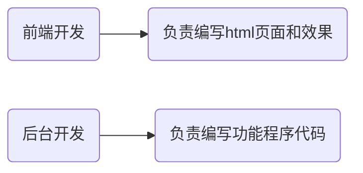

# SMART模板

<!-- more -->

# 基本概念

## 1. why使用SMARTY模板技术

在web项目开发中，程序通常可以分为html模板页面和php程序页面，理想状态下，前端开发者负责编写html模板页面；而后台开发者负责编写php功能程序页面；



但是，由于长期以来人们为了追求开发的便利性，经常是将html代码与php程序代码混合编写，这样的方式其实并不利于分工合作。

比如当我需要对现有页面进行改版，前端人员由于不懂PHP程序，只能先写好HTML页面模板，再交给后台开发人员重复一次以前嵌套PHP程序的工作。

 

而SMARTY模板技术，却很好的==将前端html代码==与==程序PHP代码==进行的==分离==，让前端开发者可以专心于开发前端的代码，而不必理会PHP程序；同时也让PHP程序开发者能够专注于PHP代码的构建，而不必为将数据嵌套进前端页面而烦恼。


## 2. what是SMARTY模板技术

SMARTY模板技术是众多模板技术中的一种，而模板技术是一种将HTML代码和PHP代码强制分离的模板机制，它通过了某种方式让HTML代码与PHP代码在一起编写的过程中实现了强制分离。


所以SMARTY模板技术也就是：**一种将HTML代码和PHP代码强制分离的模板机制。**


## 3. SMARTY模板技术的特点

SMARTY模板技术的主要特点：

> 1. smarty是一个基于**PHP开发**的PHP模板引擎，由于采用PHP编写，所以语法结构与PHP基本类似，语句比较自由；
> 2. 相对其他的模板引擎，具有更快的响应速度（速度快）；
> 3. Smarty插件非常灵活，可以任意的扩展；
> 4. 也有**不适合使用Smarty的地方**，比如一些需要**实时更新**的项目（股票的走势），因为Smarty把数据都缓存起来了，没法实时更新！

 

各框架和开源系统模板引擎使用一览：

> ThinkPHP框架（引入了模板引擎技术）
>
> CI、YII（引入了模板引擎技术）
>
> DEDECMS（引入了模板引擎技术）
>
> ECSHOP（引入了模板引擎技术，使用的就是smarty模板引擎）


## 4. 实现的基本原理

**==需求==**：封装一个名为smarty1的类，实现通过该类展示模板页面并输出数据到页面的效果。

**==解答==**：

构建名为Smarty1.class.php的程序文件，代码如下：

```php
<?php

$title = '劝学';
$auth = '荀子';
$date = '约公元前313年－公元前238年';

$content = '故不积跬步，无以至千里；不积小流，无以成江海。骐骥一跃，不能十步；驽马十驾，功在不舍。锲而舍之，朽木不折；锲而不舍，金石可镂。';

class Smarty1{

    private $_data=[];

    public function assign1($k, $v){ 
        //                  title    劝学
        //                  auth   荀子
        $this->_data[$k] = $v;
    }

    public function display1($fileName){ 
        //                                               ./index.html
        $fileContent = file_get_contents($fileName);//读取模板文件的内容

        //print_r($this->_data);

        //替换模板文件中的占位符
        foreach( $this->_data as $k=>$v ){ 
            
            //            {$   title  }
            //            {$   auth }
            //            {$   date }
            //            {$   content }
            $target = '{$'.$k.'}';
            //                                   {$title}    劝学
            //                                   {$auth}    荀子
            //                                   {$date}    约公元前313年－公元前238年
            $fileContent = str_replace($target, $v, $fileContent);
        }

        //$fileContent = str_replace('{$title}', $this->_data['title'], $fileContent);
        //$fileContent = str_replace('{$auth}', $this->_data['auth'], $fileContent);
        //$fileContent = str_replace('{$date}', $this->_data['date'], $fileContent);
        //$fileContent = str_replace('{$content}', $this->_data['content'], $fileContent);

        //输出替换后的模板内容
        echo $fileContent; 
    }

}

$smarty1 = new Smarty1;

$smarty1->assign1('title', $title);
$smarty1->assign1('auth', $auth);
$smarty1->assign1('date', $date);
$smarty1->assign1('content', $content);

$smarty1->display1('./index.html');

//include './index.html';
```


# SMARTY部署

SMARTY并不是PHP本身就自带的，在使用之前，需要先进行部署。


**==步骤==**：

第一步，首先下载SMARTY，www.smarty.net，然后解压压缩包，


第二步，将SMARTY的核心类库文件复制一份，粘贴到code/demo目录中，改名为smarty


粘贴到code/demo目录中，并且改名为smarty


第三步，在code/demo目录中，创建一个名为templates的目录，


smarty目录中的文件基本说明：


第四步，在demo目录中创建名为index1.php的程序文件，代码内容如下


访问index1.php文件，


### 1. SMARTY模板编译的原理

当我们首次访问网站的某个页面时，SMARTY会自动在项目的smarty核心库目录同级的目录中创建一个名为templates_c的目录，这个目录存放的就是SMARTY的模板编译缓存文件。

 

SMARTY有一个机制，如果第一次访问某个模板页面时，则会自动创建一个该模板页面对应的编译缓存文件；以后再来访问该页面，则SMARTY会判断该模板页面是否已经发生改变，如果没有发生改变，则直接去访问编译缓存文件，如果发现模板内容有被改变，则重新编译生一个新的缓存文件，覆盖老的缓存文件。


**==测试1==**：测试首次访问一个模板页面，观察是否生成对应的编译缓存文件。


**==测试2==**：打开已经生成的编译缓存文件，输出"哈哈"，观察再次访问相同的页面时，是否会输出"哈哈"。


**==测试3==**：改变模板文件的内容，再次访问此页面，观察是否还会访问之前的缓存文件输出缓存文件中的"哈哈"。


**==小结==**：本质上就是根据模板最后修改时间来进行判断的，在生成模板缓存文件的同时，还会记录下该模板文件的最后修改时间，当下一次再次访问这个模板文件时，则会进行判断：如果上一次记录下来的最后修改时间与本次访问是该模板的最后修改时间一直，这说明模板文件没有被修改，那么直接走模板缓存文件；如果上一次记录下来的最后修改时间与本次访问时该模板的最后修改时间不一致，则说明模板已经发生了改变，那么将会重新走一次 读取、替换、输出并且生成新的缓存内容覆盖掉老的缓存内容

### 2. SMARTY模板技术分类

SMARTY模板技术有两个分类：1）程序设计；2）模板设计；


# SMARTY程序设计

在PHP程序里面所做的事情，也就是用smarty在PHP文件里写的东西叫 程序设计


## 1. SMARTY属性设置

### 1.1 定界符

在模板当中包裹SMARTY语句的符号，即定界符。

默认的**左**定界符：==**{**==

默认的**右**定界符：==**}**==


我们可以通过SMARTY对象中的两个属性修改定界符

> left_delimiter非静态属性          负责控制左定界符
>
> right_delimiter非静态属性      负责控制右定界符


**==需求==**：测试修改默认的左定界符为"{--"，右定界符为"?}"，查看页面访问效果。

**==解答==**：构建名为index2.php文件，代码如下：

```php
<?php

$title = '劝学';
$auth = '荀子';

#1.引入smarty核心类文件
include './smarty/Smarty.class.php';

#2.实例化Smarty类的对象
$smarty = new Smarty;

#修改左右定界符
$smarty->left_delimiter = '{--';//左定界符
$smarty->right_delimiter = '&}';//右定界符


#3.分配模板变量
$smarty->assign('title',$title);
$smarty->assign('auth',$auth);

#4.渲染模板
$smarty->display('index2.html');
```

构建名为index2.html文件，代码如下：

```html
<!DOCTYPE html>
<html lang="en">
<head>
	<meta charset="UTF-8">
	<title>Document</title>
	<style type="text/css">
		.s1{color:red;}
	</style>
</head>
<body>
	<p>
		<span class='s1'>标题：</span>{--$title&}
	</p>
	
	<p>
		<span>作者：</span>{$auth}
	</p>
</body>
</html>
```

访问结果：


**==小结==**：有时候，为了避免左右大括号和其他的比如CSS样式的冲突，我们会修改左右定界符。


### 1.2 目录设置

在Smarty3.0以后的版本，我们可以调用Smarty对象的方法修改模板目录和编译缓存目录：

> setTemplateDir()   修改模板目录
>
> setCompileDir()    修改编译目录


**==需求1==**：在code/demo目录下创建名为view的目录，将存放模板文件的目录修改为code/demo/view目录，测试效果。

**==解答1==**：在code/demo下创建view目录：


创建code/demo/index3.php文件，代码如下：

```php
<?php

$title = '劝学';
$auth = '荀子';

#1.引入smarty核心类文件
include './smarty/Smarty.class.php';

#2.实例化Smarty类的对象
$smarty = new Smarty;

#修改左右定界符
/*$smarty->left_delimiter = '{--';//左定界符
$smarty->right_delimiter = '&}';//右定界符*/

#修改存放模板文件的目录
$dir = 'D:/PHP/code php/day30/demo/view';
$smarty->setTemplateDir($dir);

#修改存放编译缓存文件的目录
/*$dir= 'D:/PHP/code php/day30/demo/view_c';
$smarty -> setCompileDir($dir);*/

#3.分配模板变量
$smarty->assign('title',$title);
$smarty->assign('auth',$auth);

#4.渲染模板
$smarty->display('index3.html');
```

创建code/demo/view/index3.html文件，代码如下：

```HTML
<!DOCTYPE html>
<HTML>
<head>
    <meta charset="UTF-8">
    <title>主页</title>
</head>
<body>
    <p>
		<span class='s1'>标题：</span>index3
	</p>

	<p>
		<span>作者：</span>{$auth}
	</p>
	<p>12</p>

</body>
</HTML>
```

访问效果：


**==小结1==**：

1. 如果我们想要修改存放模板文件的目录，则直接使用setTemplateDir非静态方法；


**==需求2==**：在程序中将存放编译缓存文件的目录修改为code/demo/view_c目录，测试效果。

**==解答2==**：在code/demo下创建view目录：


创建code/demo/index4.php文件，代码如下：

```php
<?php

$title = '劝学';
$auth = '荀子';

#引入SMARTY核心类文件
include './smarty/Smarty.class.php';

#实例化Smarty类的对象
$smarty = new Smarty;

#修改存放编译缓存文件的目录
$dir = 'F:/home/class/day21/code/demo/view_c';
$smarty->setCompileDir($dir);

//分配模板变量
$smarty->assign('auth', $auth);

//渲染模板
$smarty->display('index4.html');
```

创建code/demo/view/index4.html文件，代码如下：

```HTML
<!DOCTYPE html>
<HTML>
<head>
    <meta charset="UTF-8">
    <title>主页</title>
</head>
<body>
    <p>
		<span class='s1'>标题：</span>index4
	</p>

	<p>
		<span>作者：</span>{$auth}
	</p>
	<p>12</p>

</body>
</HTML>
```

访问后效果：


**==小结2==**：

1. 我们可以通过setCompileDir非静态方法修改存放编译缓存文件的目录；


### 1.3常量设置

通常情况下，我们在项目程序文件中，会定义一个名为SMARTY_DIR的常量，定义这个常量可以向下兼容老版本的SMARTY。


**==需求==**：在程序中定义SMARTY_DIR常量，测试效果。

**==解答==**：创建code/demo/index5.php文件，代码如下：同时还涉及到index5.html

```php
<?php

$title = '劝学';
$auth = '荀子';

//定义SMARTY根目录的常量
define('SMARTY_DIR', dirname(__FILE__).'/smarty/');

#引入SMARTY核心类文件
include './smarty/Smarty.class.php';

#实例化Smarty类的对象
$smarty = new Smarty;

//分配模板变量
$smarty->assign('auth', $auth);

//渲染模板
$smarty->display('index5.html');
```

访问后效果：


**==小结==**：我们可以在引入SMARTY核心类文件之前先定义一个目录路径常量名字叫:SMARTY_DIR


# SMARTY模板设计

使用smarty技术在模板里面所做的事情

## 1. SMARTY模板注释

语法：**{\***注释内容***}** 


**==测试==**：创建code/demo/index6.php文件，代码如下：

```php
<?php

$title = '劝学';
$auth = '荀子';

//定义SMARTY根目录的常量
define('SMARTY_DIR', dirname(__FILE__).'/smarty/');

#引入SMARTY核心类文件
include './smarty/Smarty.class.php';

#实例化Smarty类的对象
$smarty = new Smarty;

//分配模板变量
$smarty->assign('auth', $auth);

//渲染模板
$smarty->display('index6.html');
```

创建code/demo/templates/index6.html文件，代码如下：

```HTML
<!DOCTYPE html>
<html lang="en">
<head>
	<meta charset="UTF-8">
	<title>Document</title>
</head>
<body>
	<!-- 这是HTML的注释内容 -->
	{*这是PHP的注释内容*}
	<p>
		<span>标题：</span>index6
	</p>
	<p>
		<span>作者：</span>{$auto}
	</p>
	<p>12</p>
</body>
</html>
```


**==小结==**：

1. SMARTY的模板注释在浏览器中是看不到的，只有打开原文件才能看到。


## 2. SMARTY模板变量

SMARTY模板变量包括三个种类：1）简单模板变量；2）数组模板变量；3）对象模板变量；

### 2.1 简单模板变量

概念：即分配的数据为标量数据类型的变量；


**==测试==**：创建code/demo/index7.php文件，代码如下：

```php
<?php 

$title = '劝学';
$deposit=100000;
$auth = '荀子';
$bool = true;

//定义SMARTY根目录的常量
define('SMARTY_DIR', dirname(__FILE__).'/smarty/');

#1. 引入SMARTY核心类文件
include './smarty/Smarty.class.php';

#2. 实例化Smarty类的对象
$smarty = new Smarty;


//分配模板变量
$smarty->assign('auth',$auth);
$smarty->assign('title',$title);
$smarty->assign('aa',$deposit);
$smarty->assign('bb',$bool);

//渲染模板
$smarty->display('index7.html');
```

创建code/demo/templates/index7.html文件，代码如下：

```html
<!DOCTYPE html>
<html lang="en">
<head>
	<meta charset="UTF-8">
	<title>Document</title>
</head>
<body>
	<p>
		<span class='s1'>标题：</span>{$title}
	</p>
	
	<p>
		<span>作者:</span>{$auth}
	</p>
	<p>
		<span>zhangsan的存款：</span>{$aa}
	</p>
	<p>
		<span>看看布尔值:</span>{$bb}
	</p>
</body>
</html>
```

访问后效果：


**==小结==**：

1. 在程序中通过assign分配给模板的变量；
2. 分配的变量他的值需要是标量数据类型的值，这种模板变量就称为简单模板变量。


### 2.2 数组模板变量

概念：即分配的数据为数组数据类型的变量；


**==测试==**：创建code/demo/index8.php文件，代码如下：

```php
<?php 

$auth = '荀子';
$name = ['张三','李四','王五','special'=>'哪吒'];

//定义SMARTY根目录的常量
define('SMARTY_DIR', dirname(__FILE__).'/smarty/');

#1. 引入SMARTY核心类文件
include './smarty/Smarty.class.php';

#2. 实例化Smarty类的对象
$smarty = new Smarty;

//分配模板变量
$smarty->assign('auth',$auth);
$smarty->assign('aa',$name);

//渲染模板
$smarty->display('index8.html');
```

创建code/demo/templates/index8.html文件，代码如下：

```html
<!DOCTYPE html>
<html lang="en">
<head>
	<meta charset="UTF-8">
	<title>Document</title>
</head>
<body>
	<p>
		<span class='s1'>标题：</span>index8
	</p>
	<p>
		<span>作者:</span>{$auth}
	</p>
	<p>
		<span>名字集合：</span>
	</p>
	<p>
		<span>名字1：</span>{$aa.0}
	</p>
	<p>
		<span>名字2：</span>{$aa.1}
	</p>
	<p>
		<span>名字3：</span>{$aa.2}
	</p>
	<p>
		<span>名字special：</span>{$aa['special']}
	</p>
</body>
</html>
```

访问后效果：


**==小结==**：所谓的数组模板变量，指的是分配的模板变量保存的是一个数组数据；


### 2.3 对象模板变量

概念：即分配的数据为对象数据类型的变量；


**==测试==**：创建code/demo/index9.php文件，代码如下：

```php
<?php

$auth = '荀子';

class A{
    public $name1='张三丰';
    public $name2='李世民';
    public $name3='王羲之';

    public function f1(){ 
        echo '哈哈哈'; 
    }
}

$a1 = new A;

//定义SMARTY根目录的常量
define('SMARTY_DIR', dirname(__FILE__).'/smarty/');

#引入SMARTY核心类文件
include './smarty/Smarty.class.php';

#实例化Smarty类的对象
$smarty = new Smarty;

//分配模板变量
$smarty->assign('auth', $auth);
$smarty->assign('a1', $a1);

//渲染模板
$smarty->display('index9.html');
```

创建code/demo/templates/index9.html文件，代码如下：

```html
<!DOCTYPE html>
<HTML>
<head>
    <meta charset="UTF-8">
    <title>主页</title>
</head>
<body>
    <p>
		<span class='s1'>标题：</span>index8
	</p>

	<p>
		<span>作者：</span>{$auth}
	</p>
	<p>12</p>

	<p>
		<span>名字1：</span>{$a1->name1}
	</p>
	<p>
		<span>名字2：</span>{$a1->name2}
	</p>
	<p>
		<span>名字3：</span>{$a1->name3}
	</p>
	<p>
		<span>方法：</span>{$a1->f1()}
	</p>

</body>
</HTML>
```

访问后效果：


**==小结==**：所谓的对象模板变量，指的是分配的模板变量保存的数据是对象类型的数据。


## 3. SMARTY系统变量

SMARTY系统变量有：

> **{$smarty.get.变量名称}**    直接获取GET参数数据
>
> **{$smarty.post.变量名称}**      直接获取POST参数数据
>
> **{$smarty.cookies.变量名称}**     直接获取COOKIE参数数据
>
> **{$smarty.session.变量名称}**     直接获取SESSION参数数据
>
> **{$smarty.const.常量名称}**      直接获取常量参数数据
>
> **{$smarty.now}**      直接获取当前时间的时间戳


**==测试==**：测试**{$smarty.get.变量名称}**、**{$smarty.const.常量名称}**、**{$smarty.now}**

创建code/demo/index10.php文件，代码如下：

```php
<?php

$auth = '荀子';

//定义SMARTY根目录的常量
define('SMARTY_DIR', dirname(__FILE__).'/smarty/');

#引入SMARTY核心类文件
include './smarty/Smarty.class.php';

#实例化Smarty类的对象
$smarty = new Smarty;

//分配模板变量
$smarty->assign('auth', $auth);

//渲染模板
$smarty->display('index10.html');
```

创建code/demo/templates/index10.html文件，代码如下：

```html
<!DOCTYPE html>
<HTML>
<head>
    <meta charset="UTF-8">
    <title>主页</title>
</head>
<body>
    <p>
		<span class='s1'>标题：</span>index10
	</p>

	<p>
		<span>姓名：</span>{$smarty.get.name}  {*相当于$_GET['name']*}
	</p>
	<p>
		<span>年龄：</span>{$smarty.get.age}
	</p>
	<p>
		<span>身高：</span>{$smarty.get.height}
	</p>
	<p>
		<span>常量值：</span>{$smarty.const.SMARTY_DIR}
	</p>
	<p>
		<span>当前时间的时间戳：</span>{$smarty.now}
	</p>

</body>
</HTML>
```

访问效果：


**==小结==**：

系统变量就是获得$smarty后面所指定的九大超全局预定义数组变量（还包括常量和当前时间的时间戳）中的下标对应的值的。


## 4. SMARTY内置函数（内建函数）

### 4.1 foreach

==**作用**==：在模板中实现foreach遍历，性质相当于PHP中的foreach遍历。

==**定义语法**==：

```php
{foreach from=$目标数组模板变量 [key=’保存元素下标的模板变量名’ ] item=’保存元素值的模板变量名’  [name=’当前foreach的别名’]}
       foreach遍历结构体
{/foreach}
```


**==测试==**：创建code/demo/index11.php文件，代码如下：

```php
<?php 

$arr = ['桂林米粉','螺蛳粉','陈村粉','洗衣粉'];

define('SMARTY_DIR',dirname(__FILE__).'/smarty/');

#1. 引入SMARTY核心类文件
include './smarty/Smarty.class.php';

#2. 实例化Smarty类的对象
$smarty = new Smarty;

//分配模板变量
$smarty->assign('aa',$arr);

//渲染模板
$smarty->display('index11.html');
```

创建code/demo/templates/index11.html文件，代码如下：

```html
<!DOCTYPE html>
<html lang="en">
<head>
	<meta charset="UTF-8">
	<title>Document</title>
</head>
<body>
	<p>
		<span class='s1'>标题：</span>index11
	</p>
	
	
	{foreach from=$aa key='k' item='v'}
	<p>
		<span> 粉{$k+1}: </span>{$v}
	</p>
	{/foreach}

	<hr>
	<p>
		<span> 粉2: </span>螺蛳粉
	</p>
	<p>
		<span> 粉3: </span>陈村粉
	</p>
	<p>
		<span> 粉4: </span>洗衣粉
	</p>

</body>
</html>
```

访问效果：


**==小结==**：

foreach内建函数就相当于PHP中的foreach结构


### 4.2 foreachelse

==作用==：当foreach遍历的数组为空数组或不存在时，则将执行foreachelse部分。


**==测试==**：创建code/demo/index12.php文件，代码如下：

```php
<?php

//$arr = ['桂林米粉', '螺蛳粉', '陈村粉', '洗衣粉'];
$arr = [];

//定义SMARTY根目录的常量
define('SMARTY_DIR', dirname(__FILE__).'/smarty/');

#引入SMARTY核心类文件
include './smarty/Smarty.class.php';

#实例化Smarty类的对象
$smarty = new Smarty;

//分配模板变量
$smarty->assign('aa', $arr);

//渲染模板
$smarty->display('index12.html');
```

创建code/demo/templates/index12.html文件，代码如下：

```php
<!DOCTYPE html>
<HTML>
<head>
    <meta charset="UTF-8">
    <title>主页</title>
</head>
<body>
    <p>
		<span class='s1'>标题：</span>index12
	</p>

	{foreach from=$aa key='k' item='v'}
	<p>
		<span>粉{$k+1}：</span>{$v}
	</p>
	{foreachelse}
	<p>
		没有粉吃，只剩面条了
	</p>
	{/foreach}

	<hr/>

	<p>
		<span>粉1：</span>桂林米粉
	</p>
	<p>
		<span>粉2：</span>螺蛳粉
	</p>
	<p>
		<span>粉3：</span>陈村粉
	</p>
	<p>
		<span>粉4：</span>洗衣粉
	</p>


</body>
</HTML>
```

访问效果：


**==小结==**：foreachelse类似于if...else中的else结构，当遍历的数组为空时，则直接走进foreachelse中去执行。、


### 4.3 foreach内置变量

foreach内置变量包括：

> {**$smarty.foreach.**foreach循环名**.index**}     表示获得当前的索引值
>
> {**$smarty.foreach.**foreach循环名**.iteration**}    表示获得当前遍历的次数（当前遍历到了第几次）


**==测试==**：创建code/demo/index13.php文件，代码如下：

```php
<?php

$arr = ['桂林米粉', '螺蛳粉', 'aa'=>'洗衣粉'];

//定义SMARTY根目录的常量
define('SMARTY_DIR', dirname(__FILE__).'/smarty/');

#引入SMARTY核心类文件
include './smarty/Smarty.class.php';

#实例化Smarty类的对象
$smarty = new Smarty;

//分配模板变量
$smarty->assign('aa', $arr);

//渲染模板
$smarty->display('index13.html');
```

创建code/demo/templates/index13.html文件，代码如下：

```html
<!DOCTYPE html>
<HTML>
<head>
    <meta charset="UTF-8">
    <title>主页</title>
</head>
<body>
    <p>
		<span class='s1'>标题：</span>index12
	</p>

	{foreach from=$aa key='k' item='v' name='f1'}
	<p>索引值：{$smarty.foreach.f1.index}</p>
	<p>遍历到第几次：{$smarty.foreach.f1.iteration}</p>
	<p>
		<span>粉{$smarty.foreach.f1.iteration}：</span>{$v}
	</p>
	<hr/>
	{/foreach}


</body>
</HTML>
```

访问效果：


==小结==**：使用这两个变量需要在foreach结构中才能使用。


### 4.4 include

==**作用**==：引入其他模板文件。

==**定义语法**==：

```php
{include  file=’模板路径’  [额外分配模板变量的名1=额外分配模板变量的值1]  [额外分配模板变量的名2=额外分配模板变量的值2] […]  [额外分配模板变量的名n=额外分配模板变量的值n]}
```


**==测试==**：创建code/demo/index12.php文件，代码如下：

```php
<?php

//$arr = ['桂林米粉', '螺蛳粉', '陈村粉', '洗衣粉'];
$arr = [];

//定义SMARTY根目录的常量
define('SMARTY_DIR', dirname(__FILE__).'/smarty/');

#引入SMARTY核心类文件
include './smarty/Smarty.class.php';

#实例化Smarty类的对象
$smarty = new Smarty;

//分配模板变量
$smarty->assign('aa', $arr);

//渲染模板
$smarty->display('index12.html');
```

创建code/demo/templates/index12.html文件，代码如下：

```html 
{include file='common.html' aa='index12'}
<body>
    <p>
		<span class='s1'>标题：</span>index12
	</p>

	{foreach from=$aa key='k' item='v'}
	<p>
		<span>粉{$k+1}：</span>{$v}
	</p>
	{foreachelse}
	<p>
		没有粉吃，只剩面条了
	</p>
	{/foreach}

	<hr/>

	<p>
		<span>粉1：</span>桂林米粉
	</p>
	<p>
		<span>粉2：</span>螺蛳粉
	</p>
	<p>
		<span>粉3：</span>陈村粉
	</p>
	<p>
		<span>粉4：</span>洗衣粉
	</p>

</body>
</HTML>
```

创建code/demo/templates/index12.html文件，代码如下：

```html
{include file='common.html' aa='index12'}
<body>
    <p>
		<span class='s1'>标题：</span>index12
	</p>

	{foreach from=$aa key='k' item='v'}
	<p>
		<span>粉{$k+1}：</span>{$v}
	</p>
	{foreachelse}
	<p>
		没有粉吃，只剩面条了
	</p>
	{/foreach}

	<hr/>

	<p>
		<span>粉1：</span>桂林米粉
	</p>
	<p>
		<span>粉2：</span>螺蛳粉
	</p>
	<p>
		<span>粉3：</span>陈村粉
	</p>
	<p>
		<span>粉4：</span>洗衣粉
	</p>

</body>
</HTML>
```

创建code/demo/templates/index13.html文件，代码如下：index13.html配合程序文件为index13.php

```php
{include file='common.html' aa='index13'}
<body>
	<p>
		<span class='s1'>标题：</span>index13
	</p>

	{foreach from=$aa key='k' item='v' name='f1'}
	
	<p>索引值：{$smarty.foreach.f1.index}</p>
	<p>遍历到第几次：{$smarty.foreach.f1.iteration}</p>
	<p>
		<span> 粉{$smarty.foreach.f1.iteration}: </span>{$v}
	</p>
	<hr>
	{foreachelse}
	<p>
		没有粉吃，只剩面条了
	</p>

	{/foreach}
</body>
</html>
```

访问效果：

访问index12.php


访问index13.php


**==小结==**：

include可以在模板文件中引入需要的模板文件。


### 4.5 if...elseif...else

==**作用**==：在模板中实现if..elseif..else分支。


**==测试==**：创建code/demo/index14.php文件，代码如下：

```php
<?php

//定义SMARTY根目录的常量
define('SMARTY_DIR', dirname(__FILE__).'/smarty/');

#引入SMARTY核心类文件
include './smarty/Smarty.class.php';

#实例化Smarty类的对象
$smarty = new Smarty;

$score = 30;

$smarty->assign('score', $score);

//渲染模板
$smarty->display('index14.html');
```

创建code/demo/templates/index14.html文件，代码如下：

```html
<!DOCTYPE html>
<HTML>
<head>
    <meta charset="UTF-8">
    <title>index14</title>
</head>
<body>

	{if $score>90}
		<p>优秀</p>
	{elseif $score>70}
		<p>良好</p>
	{elseif $score>60}
		<p>及格</p>
	{else}
		<p>请继续努力</p>
	{/if}

</body>
</HTML>
```

访问效果:


**==小结==**：这个内建函数和PHP中的if...elseif...else分支结构是一样的性质。


### 4.6 literal

==**作用**==：被literal包裹的部分将不会被当成smarty内容解析。


**==测试==**：创建code/demo/index15.php文件，代码如下：

```php
<?php  
	//定义SMARTY根目录的常量
	define('SMARTY_DIR', dirname(__FILE__).'/smarty/');

	#1.引入SMARTY核心类文件
	include './smarty/Smarty.class.php';

	#2.实例化Smarty类的对象
	$smarty = new Smarty;

	//渲染模板
	$smarty->display('index15.html');
```

创建code/demo/templates/index15.html文件，代码如下：

```html
<!DOCTYPE html>
<html lang="en">
<head>
	<meta charset="UTF-8">
	<title>Document</title>
</head>
<body>
	<p>
		{literal}
		<style>
		.p1{color: red;}
		</style>
		<span class="p1">哈哈哈哈哈</span>
		{/literal}
	</p>
</body>
</html>
```

访问效果：


**==小结==**：被literal内建函数包裹的内容将不会当成smarty内容解析；


### 4.7 ldelim和rdelim

==作用==：ldelim专门保存左定界符符号；rdelim专门保存右定界符符号。


**==测试==**：


**==小结==**：这两个内建函数分别代表两个符号，ldelim代表"**{**"这个符号；rdelim代表"**}**"这个符号;


## 5. SMARTY变量调节器

基本语法：

```php
{变量名|调节器名1:参数1:参数2….|调节器名2:参数1:参数2….}
```


#### cat

==**作用**==：拼接字符串。


**==测试==**：创建code/demo/index16.php文件，代码如下：


```php
<?php


//定义SMARTY根目录的常量
define('SMARTY_DIR', dirname(__FILE__).'/smarty/');

#引入SMARTY核心类文件
include './smarty/Smarty.class.php';

#实例化Smarty类的对象
$smarty = new Smarty;

$name = '嬴政';
$age = 3;

$smarty->assign('name', $name);
$smarty->assign('age', $age);


//渲染模板
$smarty->display('index16.html');
```

创建code/demo/templates/index16.html文件，代码如下：


```html
<!DOCTYPE html>
<HTML>
<head>
    <meta charset="UTF-8">
    <title>index16</title>
</head>
<body>

<p>
	<span>cat调节器：</span>{$name|cat:$age|cat:'岁啦'}
</p>

</body>
</HTML>
```

访问效果：


**==小结==**：cat负责拼接字符串的。


#### date_format

==作用==：将时间戳格式化为年月日时间日期格式。


**==测试==**：创建code/demo/index16.php文件，代码如下：

```php
<?php


//定义SMARTY根目录的常量
define('SMARTY_DIR', dirname(__FILE__).'/smarty/');

#引入SMARTY核心类文件
include './smarty/Smarty.class.php';

#实例化Smarty类的对象
$smarty = new Smarty;

$name = '嬴政';
$age = 3;

$smarty->assign('name', $name);
$smarty->assign('age', $age);


//渲染模板
$smarty->display('index16.html');
```

创建code/demo/templates/index16.html文件，代码如下：

```html
<!DOCTYPE html>
<HTML>
<head>
    <meta charset="UTF-8">
    <title>index16</title>
</head>
<body>

<p>
	<span>cat调节器：</span>{$name|cat:$age|cat:'岁啦'}
</p>
<p>
	<span>date_format调节器：</span>{$smarty.now|date_format:'%Y-%m-%d %H:%M:%S'}
</p>
<p>
	<span>当前时间日期：</span>{date('Y-m-d H:i:s')}
</p>

</body>
</HTML>
```

访问效果：


**==小结==**：date_format可以转换时间戳，但是我们可以使用PHP的内置函数实现。


#### default

==作用==：指定默认值。


**==测试==**：创建code/demo/index16.php文件，代码如下：

```php
<?php


//定义SMARTY根目录的常量
define('SMARTY_DIR', dirname(__FILE__).'/smarty/');

#引入SMARTY核心类文件
include './smarty/Smarty.class.php';

#实例化Smarty类的对象
$smarty = new Smarty;

$name = '嬴政';
$age = 3;

$smarty->assign('name', $name);
$smarty->assign('age', $age);


//渲染模板
$smarty->display('index16.html');
```

创建code/demo/templates/index16.html文件，代码如下：

```html
<!DOCTYPE html>
<HTML>
<head>
    <meta charset="UTF-8">
    <title>index16</title>
</head>
<body>

<p>
	<span>cat调节器：</span>{$name|cat:$age|cat:'岁啦'}
</p>
<p>
	<span>date_format调节器：</span>{$smarty.now|date_format:'%Y-%m-%d %H:%M:%S'}
</p>
<p>
	<span>当前时间日期：</span>{date('Y-m-d H:i:s')}
</p>
<p>
	<span>default调节器：</span>{$var1|default:'这是默认值'}
</p>

</body>
</HTML>
```

访问效果：


**==小结==**：default表示当变量不存在时，则使用默认值。


#### lower和upper

==作用==：lower负责将字母转换为小写；upper负责将字母转换为大写。


**==测试==**：创建code/demo/index16.php文件，代码如下：

```php
<?php


//定义SMARTY根目录的常量
define('SMARTY_DIR', dirname(__FILE__).'/smarty/');

#引入SMARTY核心类文件
include './smarty/Smarty.class.php';

#实例化Smarty类的对象
$smarty = new Smarty;

$name = '嬴政';
$age = 3;

$smarty->assign('name', $name);
$smarty->assign('age', $age);


//渲染模板
$smarty->display('index16.html');

```

创建code/demo/templates/index16.html文件，代码如下：

```html
<!DOCTYPE html>
<HTML>
<head>
    <meta charset="UTF-8">
    <title>index16</title>
</head>
<body>

<p>
	<span>cat调节器：</span>{$name|cat:$age|cat:'岁啦'}
</p>
<p>
	<span>date_format调节器：</span>{$smarty.now|date_format:'%Y-%m-%d %H:%M:%S'}
</p>
<p>
	<span>当前时间日期：</span>{date('Y-m-d H:i:s')}
</p>
<p>
	<span>default调节器：</span>{$var1|default:'这是默认值'}
</p>
<p>
	<span>lower调节器：</span>{'abcEFdddd'|lower}
</p>
<p>
	<span>upper调节器：</span>{'abcEFdddd'|lower|upper}
</p>

</body>
</HTML>
```

访问效果：


**==小结==**：lower负责将字母全部转为小写；upper负责将字母全部转为大写。


#### escape

==作用==：负责将变量中的html标签当成普通字符串输出。


**==测试==**：创建code/demo/index16.php文件，代码如下：

```php
<?php


//定义SMARTY根目录的常量
define('SMARTY_DIR', dirname(__FILE__).'/smarty/');

#引入SMARTY核心类文件
include './smarty/Smarty.class.php';

#实例化Smarty类的对象
$smarty = new Smarty;

$name = '嬴政';
$age = 3;
$str = '<span style="color:green;">哼哼哈he</span>';

$smarty->assign('name', $name);
$smarty->assign('age', $age);
$smarty->assign('str', $str);


//渲染模板
$smarty->display('index16.html');
```

创建code/demo/templates/index16.html文件，代码如下：

```html
<!DOCTYPE html>
<HTML>
<head>
    <meta charset="UTF-8">
    <title>index16</title>
</head>
<body>

<p>
	<span>cat调节器：</span>{$name|cat:$age|cat:'岁啦'}
</p>
<p>
	<span>date_format调节器：</span>{$smarty.now|date_format:'%Y-%m-%d %H:%M:%S'}
</p>
<p>
	<span>当前时间日期：</span>{date('Y-m-d H:i:s')}
</p>
<p>
	<span>default调节器：</span>{$var1|default:'这是默认值'}
</p>
<p>
	<span>lower调节器：</span>{'abcEFdddd'|lower}
</p>
<p>
	<span>upper调节器：</span>{'abcEFdddd'|lower|upper}
</p>
<p>
	<span>escape调节器：</span>{$str|escape}
</p>

</body>
</HTML>
```

访问效果：


**==小结==**：escape可以让字符串中的标签不被html解析。


#### nl2br

==作用==：负责将文件的回车换行转换为html的\<br/>标签。


**==测试==**：创建code/demo/index16.php文件，代码如下：

```php
<?php


//定义SMARTY根目录的常量
define('SMARTY_DIR', dirname(__FILE__).'/smarty/');

#引入SMARTY核心类文件
include './smarty/Smarty.class.php';

#实例化Smarty类的对象
$smarty = new Smarty;

$name = '嬴政';
$age = 3;
$str = '<span style="color:green;">哼哼哈he</span>';
$str1 ="请看接下来另起一行\r\n哈哈，我成功到了第二行";

$smarty->assign('name', $name);
$smarty->assign('age', $age);
$smarty->assign('str', $str);
$smarty->assign('str1', $str1);


//渲染模板
$smarty->display('index16.html');

```

创建code/demo/templates/index16.html文件，代码如下：

```html
<!DOCTYPE html>
<HTML>
<head>
    <meta charset="UTF-8">
    <title>index16</title>
</head>
<body>

<p>
	<span>cat调节器：</span>{$name|cat:$age|cat:'岁啦'}
</p>
<p>
	<span>date_format调节器：</span>{$smarty.now|date_format:'%Y-%m-%d %H:%M:%S'}
</p>
<p>
	<span>当前时间日期：</span>{date('Y-m-d H:i:s')}
</p>
<p>
	<span>default调节器：</span>{$var1|default:'这是默认值'}
</p>
<p>
	<span>lower调节器：</span>{'abcEFdddd'|lower}
</p>
<p>
	<span>upper调节器：</span>{'abcEFdddd'|lower|upper}
</p>
<p>
	<span>escape调节器：</span>{$str|escape}
</p>
<p>
	<span>nl2br调节器：</span>{$str1|nl2br}
</p>

</body>
</HTML>
```

访问效果：


**==小结==**：nl2br可以将文件的回车换行符转换成\<br/\>标签。


#### strip_tags

==作用==：负责将html标签字符直接去除 。


**==测试==**：创建code/demo/index16.php文件，代码如下：

```php
<?php


//定义SMARTY根目录的常量
define('SMARTY_DIR', dirname(__FILE__).'/smarty/');

#引入SMARTY核心类文件
include './smarty/Smarty.class.php';

#实例化Smarty类的对象
$smarty = new Smarty;

$name = '嬴政';
$age = 3;
$str = '<span style="color:green;">哼哼哈he</span>';
$str1 ="请看接下来另起一行\r\n哈哈，我成功到了第二行";

$smarty->assign('name', $name);
$smarty->assign('age', $age);
$smarty->assign('str', $str);
$smarty->assign('str1', $str1);


//渲染模板
$smarty->display('index16.html');
```

创建code/demo/templates/index16.html文件，代码如下：

```html
<!DOCTYPE html>
<HTML>
<head>
    <meta charset="UTF-8">
    <title>index16</title>
</head>
<body>

<p>
	<span>cat调节器：</span>{$name|cat:$age|cat:'岁啦'}
</p>
<p>
	<span>date_format调节器：</span>{$smarty.now|date_format:'%Y-%m-%d %H:%M:%S'}
</p>
<p>
	<span>当前时间日期：</span>{date('Y-m-d H:i:s')}
</p>
<p>
	<span>default调节器：</span>{$var1|default:'这是默认值'}
</p>
<p>
	<span>lower调节器：</span>{'abcEFdddd'|lower}
</p>
<p>
	<span>upper调节器：</span>{'abcEFdddd'|lower|upper}
</p>
<p>
	<span>escape调节器：</span>{$str|escape}
</p>
<p>
	<span>nl2br调节器：</span>{$str1|nl2br}
</p>
<p>
	<span>strip_tags调节器：</span>{$str|strip_tags}
</p>

</body>
</HTML>
```

访问效果：


**==小结==**：strip_tags可以直接将标签去除。
