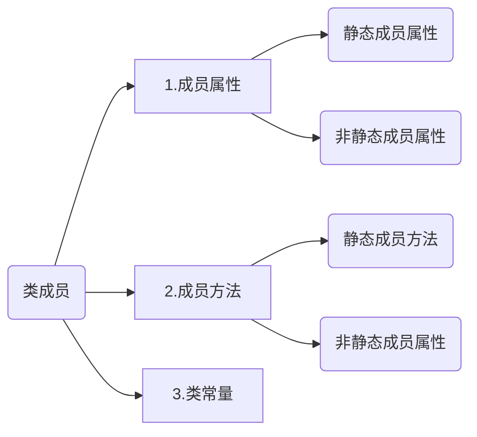

# 面向对象
<!-- more -->


# 1.概念

## 1.1why使用面向对象

编程思想有两个大类：1）面向过程思想；2）面向对象思想；


#### 面向过程思想介绍

**==小结==**：

面向过程的思想：面向过程思想**面向的是整个过程**，强调的是过程中每一步的**动作**；


#### 面向对象思想介绍

同样是相同的两个场景，使用面向对象的方式来解决最终的问题：

**==小结==**：

面向对象的思想：面向对象思想**面向的是一个对象**，强调的是最终的**结果**；


#### 面向过程思想的局限性

1. 使用面向过程思想开发，代码冗余率高，重用性低；
2. 使用面向过程思想开发，如果中途需求发生改变，那么代码的改动量将会相当庞大。

 

正是由于有这些局限性，所以人们慢慢过渡到使用面向对象的方式来进行开发，解决上述局限性问题。


## 1.2what是面向对象

面向对象即**OOP**（Object Oriented Programming）

**==概念==**：以面向对象思想为指导的一种编程方式。


通俗的理解面向对象：**找个对象帮我做事**。


# 2. PHP中的类与对象

## 类

程序本质上就是对现实世界的模拟。

 

现实世界中的类是一个比较抽象的概念，比如人类，鱼类，车类等，它其实就是拥有相同特性的事物的统称；

程序当中也有类的概念。

 

现实当中类的概念：具有相同 ==特征== 和 ==行为== 的一类群体的统称。

PHP中的类的概念：具有相同 ==属性== 和 ==方法== 的一类事物的集合。


==**PHP中类的定义语法**==

```php
//定义一个类
class 类名{
    类成员
}
```


code1.php:

```php
<?php
#定义一个类
class Person{

}

echo '这就是定义一个类的方式！';
```

访问code1.php的效果：


## 类成员

类成员包括**三个大类**：



定义一个完整的包含类成员的类：

```php
<?php

#定义一个类
class Person{

    #成员属性   (如果有必要可以不指定默认值)
    //非静态成员属性
    public $name='张三';//非静态成员属性  （最常使用）

    //静态成员属性   (如果有必要可以不指定默认值)
    public static $sex='男';
    public static $weight;

    #类常量
    const AREA='广东省广州市';

    #成员方法
    //非静态成员方法
    public function singsing($name='黄河大合唱'){ 
        
        echo '我会唱' . $name; 
    }

    //静态成员方法
    public static function dancing($name='华尔兹'){ 
        
        echo '我会跳' . $name; 
    }
}

echo '这就是定义一个类的方式！';
```


## 对象

对象需要基于类的定义创建出来。

**==创建对象的语法==**

```php
//需要先定义一个类
class demoA{
    
}

//然后再基于一个已有的类创建对象
$obj = new demoA;
```


code4.php

```php
<?php

//需要先定义一个类
class demoA{
    
}

//然后再基于一个已有的类创建对象
$obj = new demoA;

var_dump( $obj ); 
```

访问code4.php效果为：


## 对象创建的原理

**==原理图==**：


**==小结==**：

1. 程序在==编译阶段==将会为类去开辟一个专属的静态成员区空间，然后将类中所有的静态成员（静态成员属性和静态成员方法）、类常量全部转移到这个空间中；（一个类只有一个静态成员区）
2. 在程序的==执行阶段==每当是使用new关键字创建一个对象时，PHP都会去内存中开辟一个全新的对象空间，并且将会把类中所有的非静态成员（非静态成员属性和非静态成员方法）全部拷贝一份到这个空间中；


## 类成员的定义

### 1. 成员属性

**==需求==**：定义名为Person的类，

1. 在Person类中定义一个非静态成员属性，名为"name"，值为"zhangsan"；
2. 在Person类中定义一个非静态成员属性，名为"age"，不指定值；
3. 在Person类中定义一个静态成员属性，名为"height"，值为"1.78"；
4. 在Person类中定义一个静态成员属性，名为"weight"，不指定值；

**==解答==**：构建名为code6.php的程序文件，代码如下：

```php
<?php

class Person{

    //非静态成员属性
    public $name='zhangsan';
    public $age;

    //静态成员属性
    public static $height=1.78;
    public static $weight;
}
```


**==小结==**：

1. 定义非静态成员属性的方式，就相当于把定义的变量写在类中，并且在前面加上public关键字；
2. 定义静态成员属性的方式，就相当于把定义的变量写在类中，并且在前面加上public和static关键字；


### 2. 成员方法

**==需求==**：定义名为Person的类，

1. 在Person类中定义一个名为singing的非静态成员方法，方法中输出"我会唱歌"；
2. 在Person类中定义一个名为dancing的静态成员方法，方法中输出"我会跳舞"；

**==解答==**：构建名为code7.php的程序文件，代码如下：

```php
<?php

class Person{

    //非静态成员方法
    public function singing(){ 
        echo '我会唱歌';
    }

    //静态成员方法
    public static function dancing(){ 
        echo '我会跳舞'; 
    }
}
```


**==小结==**：

1. 定义非静态成员方法的方式是，将定义的函数放在类中，然后在前面加上public关键字即可；
2. 定义静态成员方法的方式是，将定义的函数放在类中，然后在前面加上public和static关键字即可；


### 3. 类常量

**==需求==**：定义名为Person的类，

1. 在Person类中定义一个类常量，名为"AREA"，值为"广东省广州市"；

**==解答==**：构建名为code8.php的程序文件，代码如下：

```php
<?php

class Person{

    //类常量
    const AREA='广东省广州市';
}
```

**==小结==**：

1. 定义类常量的方式是，将const关键字定义常量的结构写在类中即可；


## 类成员的调用

### 1. 类的外部调用类成员

#### 1.1 成员属性

**==需求==**：定义名为Person的类，

1. 在Person类中定义一个非静态成员属性，名为"name"，值为"zhangsan"；
2. 在Person类中定义一个非静态成员属性，名为"age"，不指定值；
3. 在Person类中定义一个静态成员属性，名为"height"，值为"1.78"；
4. 在Person类中定义一个静态成员属性，名为"weight"，不指定值；
5. 实现在类的外部输出四个属性的值；

**==解答==**：构建名为code9.php的程序文件，代码如下：

```php
<?php

class Person{

    //非静态成员属性
    public $name='zhangsan';
    public $age;
    //静态成员属性
    public static $height=1.78;
    public static $weight;
}

#类的外部访问非静态成员属性
$obj = new Person;//必须先实例化一个对象
var_dump( $obj->name ); //调用属性不需要加上$符
echo '<br/>';
var_dump( $obj->age ); echo '<hr/>';

#类的外部访问静态成员属性
var_dump( Person::$height ); //需要加上$符
echo '<br/>';
var_dump( Person::$weight ); 
```

访问code9.php，输出的内容为：


**==小结==**：

1. 在类的外部，非静态的属性需要先实例化一个对象，然后再使用这个对象加上"->"来访问指定的属性名；
2. 在类的外部，静态的属性直接使用类名加上"::"（称为冒冒或范围解析操作符）来访问指定的静态属性，注意需要加上$符；


#### 1.2 成员方法

**==需求==**：定义名为Person的类，

1. 在Person类中定义一个名为singing的非静态成员方法，方法中输出"我会唱歌"；
2. 在Person类中定义一个名为dancing的静态成员方法，方法中输出"我会跳舞"；
3. 实现在类的外部分别调用执行singing和dancing方法；

**==解答==**：构建名为code10.php的程序文件，代码如下：

```php
<?php

class Person{

    //非静态成员方法
    public function singing(){ 
        echo '我会唱歌'; 
    }

    //静态成员方法
    public static function dancing(){ 
        echo '我会跳舞'; 
    }
}

#类的外部访问非静态成员方法
$obj = new Person;//需要先实例化一个对象
$obj->singing(); echo '<hr/>';

#类的外部访问静态成员方法
Person::dancing();
```

访问code10.php，输出的内容为：


**==小结==**：

1. 在类的外部，调用非静态方法的方式是，首先需要实例化该类的对象，然后像调用函数一样调用方法，并且在方法名前面加上该类的对象和"->"；

```php
$obj = new xxx;
$obj->方法名([参数列表]);
```

2. 在类的外部，调用静态方法的方式是，像调用函数一样调用方法，并且在方法名前面加上该类的类名和"::"；

```php
类名::方法名([参数列表]);
```


#### 1.3 类常量

**==需求==**：定义名为Person的类，

1. 在Person类中定义一个类常量，名为"AREA"，值为"广东省广州市"；
2. 实现在类的外部调用输出类常量；

**==解答==**：构建名为code11.php的程序文件，代码如下：

```php
<?php

class Person{

    //类常量
    const AREA='广东省广州市';
}

#类的外部访问类常量
var_dump( Person::AREA ); 
```

访问code11.php，输出的内容为：


**==小结==**：

在类的外部访问类常量，指向像访问普通常量一个访问，但是要在类常量名前面加上类名和"::"；

```php
类名::类常量名;
```


### 2. 类的内部调用类成员

#### 2.1 成员属性

**==需求==**：定义名为Person的类，

1. 在Person类中定义一个非静态成员属性，名为"name"，值为"zhangsan"；
2. 在Person类中定义一个静态成员属性，名为"height"，值为"1.78"；
3. 在Person类中定义一个名为test的非静态成员方法，在test方法中实现输出"name"的值和"height"的值；
4. 在Person类中定义一个名为test_static的静态成员方法，在test_static方法中实现输出"height"的值，并且尝试输出"name"的值；

**==解答==**：构建名为code12.php的程序文件，代码如下：

```php
<?php

class Person{

    public $name='zhangsan';//非静态成员属性
    public static $height=1.78;//静态成员属性

    //非静态成员测试方法
    public function test(){ 
        var_dump( $this->name ); echo '<br/>';
        var_dump( Person::$height ); 
    }

    //静态成员测试方法
    public static function test_static(){ 
        var_dump( Person::$height );  echo '<br/>';
        var_dump( $this->name );
    }
}

//调用非静态测试方法
$obj = new Person;
$obj->test(); echo '<hr/>';

//调用静态测试方法
Person::test_static();
```

访问code12.php，输出的内容为：


**==小结==**：

1. 在类的内部，访问非静态成员属性的方式是，使用$this加上"->"来访问，但是要注意的是，在静态方法里是无法通过这种方式访问到非静态成员属性的；
2. 在类的内部，访问静态成员属性的方式是，直接使用类名加上"::"的方式进行访问；


#### 2.2 成员方法

**==需求==**：定义名为Person的类，

1. 在Person类中定义一个名为singing的非静态成员方法，方法中输出"我会唱歌"；
2. 在Person类中定义一个名为dancing的静态成员方法，方法中输出"我会跳舞"；
3. 在Person类中定义一个名为test的非静态成员方法，在test方法中调用singing和dancing方法；
4. 在Person类中定义一个名为test_static的静态成员方法，在test_static方法中实现dancing方法，并且尝试调用singing；

**==解答==**：构建名为code13.php的程序文件，代码如下：

```php
<?php

class Person{

    //非静态方法
    public function singing(){ 
        echo '我会唱歌'; 
    }
    //静态方法
    public static function dancing(){ 
        echo '我会跳舞哟'; 
    }

    //非静态测试方法
    public function test(){ 
        $this->singing(); echo '<br/>';
        Person::dancing();
    }
    //静态测试方法
    public static function test_static(){ 
        Person::dancing(); echo '<br/>';
        $this->singing();
    }
}

//调用测试方法
$obj = new Person;
$obj->test(); echo '<hr/>';

Person::test_static();
```

访问code13.php，输出的内容为：


**==小结==**：

1. 在类的内部，访问非静态成员方法的方式是，使用$this加上"->"来访问，但是要注意的是，在静态方法里是无法通过这种方式访问到非静态成员方法的；
2. 在类的内部，访问静态成员方法的方式是，直接使用类名加上"::"的方式进行访问；


#### 2.3 类常量

**==需求==**：定义名为Person的类，

1. 在Person类中定义一个类常量，名为"AREA"，值为"广东省广州市"；
2. 在Person类中定义一个名为test的非静态成员方法，在test方法中输出类常量；
3. 在Person类中定义一个名为test_static的静态成员方法，在test_static方法中输出类常量；

**==解答==**：构建名为code14.php的程序文件，代码如下：

```php
<?php

class Person{

    const AREA='广东省广州市';

    //非静态测试方法
    public function test(){ 
        var_dump( Person::AREA ); 
    }
    //静态测试方法
    public static function test_static(){ 
        var_dump( Person::AREA ); 
    }
}

//调用测试方法
$obj = new Person;
$obj->test();

echo '<hr/>';

Person::test_static();
```

访问code14.php，输出的内容为：


**==小结==**：在类的内部访问类常量和在类的外部访问类常量的方式是一样的，都是使用类名加上"::"的方式进行访问的。


**$this的含义**


$this表示：“哪个对象调用，就代表那个对象”。

我们可以直接理解为$this表示当前所写在的那个对象空间。比如说上面的案例中第一次使用$obj对象调用的test方法里的$this->name属性，$this表示的是当前所在的#1空间，所以$this->name就是找#1空间下的$name属性。


## 对象的比较

在程序中，对象是保存在变量中的，变量之间可以使用"=="等于和"\=\=\="全等于进行比较，也就意味着对象也可以进行这两种比较。


**==需求==**：定义名为Person的类，

1. 在Person类中定义一个非静态成员属性，名为"name"，值为"zhangsan"；
2. 在类的外部分别对Person类创建两个对象；
3. 使用"=="等于 和  "==="全等于对两个对象进行比较，输出比较的结果；

**==解答==**：构建名为code15.php的程序文件，代码如下：

```php
<?php

class Person{

    public $name='zhangsan';
}

$obj1 = new Person;
var_dump( $obj1 ); echo '<br/>';

$obj2 = new Person;
var_dump( $obj2 ); echo '<hr/>';

var_dump( $obj1==$obj2 ); echo '<hr/>';
var_dump( $obj1===$obj2 ); 
```

访问code15.php，输出的内容为：


**==小结==**：对象如果使用"=="等于比较，那么将只会比较对象中的数据内容，只要内容一致就是true，不会比较所处的空间是否相同；对象如果使用"\=\=="全等于进行比较，那么不仅会比较对象中的数据内容，还要比较所处的空间是否是同一个对象空间，如果内容一致但是空间不一样，那么也将返回false。


## self关键字

self关键字的**作用**是，在本类的内部**代替**本类的类名。


**==需求==**：定义名为Person的类，

1. 在Person类中定义一个静态成员属性，名为"name"，值为"zhangsan"；
2. 在Person类中定义一个类常量，名为"AREA"，值为"广东省广州市"；
3. 在Person类中定义一个名为test的非静态成员方法，在test方法中输出"name"的值和类常量的值；
4. 在Person类中定义一个名为test_static的静态成员方法，在test_static方法中输出"name"的值和类常量的值；

**==解答==**：构建名为code16.php的程序文件，代码如下：

```php
<?php

class Person{

    public static $name='zhangsan';
    const AREA='广东省广州市';

    //非静态成员方法
    public function test(){ 
        var_dump( self::$name ); echo '<br/>';
        var_dump( self::AREA ); 
    }
    //静态成员方法
    public static function test_static(){ 
        var_dump( self::$name ); echo '<br/>';
        var_dump( self::AREA ); 
    }
}

$obj = new Person;
$obj->test(); echo '<hr/>';echo '<hr/>';

Person::test_static();
```

访问code16.php，输出的内容为：


**==小结==**：self就是用于在本类的内部代替本类的类名的；


## 构造方法

**定义语法**

```php
class 类名{
    //定义类中的构造方法
    public function __construct([形参列表]){
    	#方法体 和 返回值
	}
}
```


**==需求==**：使用构造方法完成对属性的赋值操作，定义名为Person的类，

1. 在Person类中定义两个非静态成员属性，名分别为"name"和"age"，不指定值；
2. 在类的外部基于Person类创建两个对象，第一个对象设置name的值为"zhangsan"，age的值为12，打印该对象；第二个对象设置name的值为lisi，age的值为16打印该对象；

**==解答==**：构建名为code18.php的程序文件，代码如下：

```php
<?php

class Person{

    public $name;
    public $age;

    //构造方法
    public function __construct($v1, $v2){ 
        
        $this->name = $v1;
        $this->age = $v2;
    }
}

$obj1 = new Person('obj1', 12);
var_dump( $obj1 ); echo '<hr/>';

$obj2 = new Person('obj2', 0.9);
var_dump( $obj2 ); 
```

访问code18.php，输出的内容为：


**==小结==**：

1. 构造方法的方法名需要是"__construct"；
2. PHP不负责定义构造方法，只负责调用构造方法；
3. PHP调用构造方法的时机是：当使用new关键字实例化一个对象时，那么构造方法将会被PHP自动调用。


**老版本的构造方法**

**说明**：在php中，早期版本的构造方法的方法名与所在类的类名一致。


## 析构方法

==**定义语法**==

```php
class 类名{
    //定义类中的析构方法（不能携带形参）
    public function __destruct(){
    	#方法体
	}
}
```


**==需求==**：定义名为Person的类，

1. 在Person类中定义1个非静态成员属性，名为"link"，不指定值；
2. 在Person类中定义1个构造方法，实现创建一个画布，并且将创建的画布资源保存给"link"；
3. 在类的外部创建2个基于Person类的对象，将2个对象打印出来；
4. 然后使用unset删除第一个创建的对象，查看最终效果；

**==解答==**：构建名为code21.php的程序文件，代码如下：

```php
<?php

class Person{

    public $link;

    public function __construct(){ 
        
        $this->link = imagecreate(300, 200);
    }

    //析构方法
    public function __destruct(){ 
        
        echo '我还会回来的～<br/>'; 
    }
}

$obj1 = new Person;
var_dump( $obj1 ); echo '<br/>';

unset($obj1);//销毁一个保存对象的变量

$obj2 = new Person;
var_dump( $obj2 ); echo '<br/>';
```

访问code21.php，输出的内容为：


**==小结==**：在程序中，销毁对象的方式有两种：

1. 使用unset销毁掉保存对象的变量；
2. 什么都不做，程序执行结束时也将会自动销毁保存对象的变量；

析构方法的特点：

1. PHP不负责定义析构方法，只负责调用析构方法；

2. PHP调用析构方法的时机是：当一个对象死亡的时候，那么析构方法将会被PHP自动调用执行；

   


## 对象的传值

在程序中，对象是保存在变量中的，变量存在值传递和引用传递，所以对象也就存在值传递和引用传递。 


### 1. 引用传递与值传递

**==需求1==**：实现对象的引用传递，定义名为Person的类，

1. 在Person类中定义1个非静态成员属性，名为"name"，值为"zhangsan"；
2. 在类的外部创建第一个基于Person类的对象保存到变量$obj1中，将$obj1以引用传递赋值的方式赋值给$obj2变量，分别将两个对象都打印出来；
3. 改变$obj2中的name值为lisi，再次将两个对象打印出来，查看最终效果；

**==解答1==**：构建名为code22.php的程序文件，代码如下：

```php
<?php

class Person{
    public $name='zhangsan';
}

$obj1 = new Person;
$obj2 = &$obj1;//以引用传递的方式将$obj1对象赋值给$obj2变量

echo '【引用传递改之前】<br/>'; 
echo '$obj1对象：'; 
var_dump( $obj1 ); echo '<br/>';
echo '$obj2对象：'; 
var_dump( $obj2 ); echo '<hr/>';

$obj2->name = 'lisi';

echo '【引用传递改之后】<br/>'; 
echo '$obj1对象：'; 
var_dump( $obj1 ); echo '<br/>';
echo '$obj2对象：'; 
var_dump( $obj2 );
```

访问code22.php，输出的内容为：


**==小结==**：对象的引用传递，改变一个对象的值，也将会影响到另外一个对象的值。


**==需求1==**：实现对象的值传递，定义名为Person的类，

1. 在Person类中定义1个非静态成员属性，名为"name"，值为"zhangsan"；
2. 在类的外部创建第一个基于Person类的对象保存到变量$obj1中，将$obj1以值传递赋值的方式赋值给$obj2变量，分别将两个对象都打印出来；
3. 改变$obj2中的name值为lisi，再次将两个对象打印出来，查看最终效果；

**==解答1==**：构建名为code23.php的程序文件，代码如下：

```php
<?php 
	class Person{
		public $name = 'zhangsan';

	}

	$obj1 = new Person;
	$obj2 = $obj1;

	var_dump($obj1->name);echo "<br>";
	var_dump($obj2->name);echo "<hr>";

	$obj2->name = 'lisi';
	var_dump($obj1->name);echo "<br>";
	var_dump($obj2->name);
```

访问code23.php，输出的内容为：


**==小结==**：对象的值传递，从效果上看，改变其中一个对象的值，也会影响到另外一个对象的值。


### 2. 引用传递与值传递的原理

对象的引用传递 原理图：


对象的值传递 原理图：


**==小结==**：

之所以对象的值传递和对象的引用传递效果是一样的，是因为无论是对象的值传递还是对象的引用传递，最终大家指向的都是同一个对象空间，所以无论改变哪一个，另外一个也都会受到影响。


所以，到目前为止，我们掌握的技术手段中，能够得到一个全新对象的方式有一种，通过new关键字来实例化出全新的对象。那么，在PHP中，还有没有其他的方式也能够得到全新的对象呢？


## 对象的克隆

==克隆语法==：

```php
class A{
    $obj1 = new A;
    
    #基于一个已有的对象克隆出一个新的对象的操作如下
    $obj2 = clone $obj1;
}
```

**==需求1==**：定义名为soldierPig的类，

1. 在soldierPig类中定义4个非静态成员属性，名分别为"name、blood、defence、attack"，不指定值；
2. 在soldierPig类中定义一个构造方法，实现对4个属性的自动赋值；
3. 在类的外部使用实例化的方式创建一个基于soldierPig类的对象，保存到$z_boss中，值分别为：（烈火，10000， 2000， 1000）；
4. 在类的外部使用实例化的方式创建一个基于soldierPig类的对象，保存到$z1中，值分别为：（野猪，1000， 200， 100）；
5. 基于$z1克隆出$z2、$z3对象，同时改名为野猪1和野猪2；


**==解答1==**：代码如下：

```php
<?php 
	class soldierPig{
		public $name;
		public $blood;
		public $defence;
		public $attack;

		public function __construct($v1,$v2,$v3,$v4){
			$this->name = $v1;
			$this->blood = $v2;
			$this->defence = $v3;
			$this->attack = $v4;

		}
	}

	$z_boss = new soldierPig('烈火',10000,2000,1000);
	var_dump($z_boss);echo "<hr>";

	$z1 = new soldierPig('野猪',1000,200,100);
	var_dump($z1);echo "<hr>";

	$z2 =clone $z1;
	$z2->name = '野猪2';
	var_dump($z2); echo "<hr>";
```

输出结果为


**==小结==**：我们可以直接使用clone关键字克隆一个全新的对象。


**提问**：上面这个案例中，每次克隆后都需要手动改名，比较麻烦，有没有方法能够让我们在克隆的同时就自动按照设定好的规则将名字进行修改呢？


### 1. __clone魔术方法

定义语法：

```php
class 类名{
	
    public function __clone(){
        #方法体
	}
}
```

**==需求1==**：使用克隆魔术方法实现自动改名，定义名为soldierPig的类，

1. 在soldierPig类中定义4个非静态成员属性，名分别为"name、blood、defence、attack"，不指定值；
2. 在soldierPig类中定义一个构造方法，实现对4个属性的自动赋值；
3. 在类的外部使用实例化的方式创建一个基于soldierPig类的对象，保存到$z1中，值分别为：（野猪，1000， 200， 100）；
4. 基于$z1克隆出$z2、$z3对象，同时实现自动改名为野猪2和野猪3；

**==解答1==**：代码如下：

```php
<?php 
	class soldierPig{
		public $name;
		public $blood;
		public $defence;
		public $attack;

		public static $count=1;

		public function __construct($v1,$v2,$v3,$v4){
			$this->name = $v1;
			$this->blood = $v2;
			$this->defence = $v3;
			$this->attack = $v4;

		}
		//__clone魔术方法
		public function __clone(){
			self::$count++;//让静态成员属性count自增1
			$this->name = "野猪".self::$count;
		}

	}

	$z1 = new soldierPig('野猪1',1000,200,100);
	var_dump($z1);echo "<hr>";

	$z2 = clone $z1;
	var_dump($z2); echo "<hr>";


	$z3 = clone $z1;
	var_dump($z3); echo "<hr>";

	$z4 = clone $z1;
	var_dump($z4);
```

结果：


**==小结==**：

1.PHP不负责定义__clone魔术方法，只负责调用该魔术方法。

2.当使用clone关键字克隆一个对象时，该魔术方法将会被PHP自动调用执行一次。


## 自动加载

**引言**：

早期的开发过程中，程序开发人员通常会将所有的可能要使用的类文件通过include的方式，引入到当前的程序脚本中。但是这么做，会使得程序加载效率过低，拖慢程序的整体执行速度。

比如，当前有三个类，A、B、C，分别定义在三个文件中，A类定义在A.class.php中，B类定义在B.class.php中，C类定义在C.class.php中。当构建一个新的项目页面时，为了操作方便，将会事先把三个类文件全部引入进项目页面，如将三个类文件引入进test.php中。

那么，如果test.php中只使用到了一个类，而另外两个类在整个项目里都没用到，则会造成解析test.php程序代码时额外的开销和浪费。


所以，在PHP中，可以使用"自动加载"这种技术方式，来弥补这样的缺陷。


"自动加载"==技术的思路==是：什么使用要用到这个类，就将这个类所在的类文件引入进项目中来。


**触发**执行自动加载的**==时机==**：当**使用到**某个类时，而当前整个程序脚本中又没有这个类的定义，就会触发PHP执行走自动加载，寻找类的定义。 


### 1. 默认的自动加载

**引言**：PHP中是通过一个固定名字的**函数**来实现默认的自动加载的。


**==需求==**：使用code/prepare目录中的A、B、C类文件，在code/code5.php中通过默认的自动加载函数实现加载A类和B类的类文件。

**==解答==**：在code5.php中构建代码如下：

```php
<?php 
	//默认的自动加载函数
	function __autoload($className){
		var_dump($className);echo "<br>";
		if ($className=='A') {
			include './prepare/A.class.php';
		}
		elseif ($className=='B') {
			include './prepare/B.class.php';
		}
		
	}


	$a1 = new A;
	var_dump($a1);echo "<hr>";

	$b1 = new B;
	var_dump($b1);echo "<hr>";
```

效果为：


**==小结==**：

1. PHP不负责定义__autoload魔术方法，只负责调用该魔术方法。
2. 调用该函数的时机时：当使用到一个类，但是当前脚本中有没有该类的定义是，则触发PHP执行默认的自动加载函数，并将该类的类名传递给参数


### 2. 自定义自动加载

**引言：**除了默认的自动加载，PHP还支持使用自定义的自动加载。


涉及函数：

> **spl_autoload_register**()    自动加载注册函数


在PHP中，自定义的自动加载有三种实现方法

- [ ] 自定义函数

- [ ] 自定义非静态方法

- [ ] 自定义静态方法


**==注意==**：无论使用哪一种方式，都需要用到spl_autoload_register函数。


#### 2.1 自定义函数

**==需求==**：使用code/prepare目录中的A、B、C类文件，在code/code6.php中通过自定义函数实现自动加载A类和B类的类文件。

**==解答==**：在code6.php中构建代码如下：

```php
<?php 
    //自定义的自动加载函数
	function f1($className){	
		var_dump($className);echo "<br>";
		if ($className=='A') {
			include './prepare/A.class.php';
		}
		elseif ($className=='B') {
			include './prepare/B.class.php';
		}			
	}
	//注册自动加载函数
	spl_autoload_register('f1');

	$a1 = new A;
	var_dump($a1);echo "<hr>";

	$b1 = new B;
	var_dump($b1);echo "<hr>";
```

效果为：


**==小结==**：

1. 如果要使用自定义的自动加载函数，则必须使用spl_autoload_resister函数注册自定义的函数

   

#### 2.2 自定义非静态方法

**==需求==**：使用code/prepare目录中的A、B、C类文件，在code/code7.php中通过自定义非静态方法实现自动加载A类和B类的类文件。

**==解答==**：在code7.php中构建代码如下：

```php
<?php 
	class Tool{
		//自定义的非静态方法f1
		public function f1($className){
			var_dump($className);echo "<br>";
			if ($className=='A') {
				include './prepare/A.class.php';
			}
			elseif ($className=='B') {
				include './prepare/B.class.php';
			}
		}
	}
	$obj = new Tool;
	//注册自动加载函数
	spl_autoload_register(array($obj,'f1'));
	
	$a1 = new A;
	var_dump($a1);echo "<hr>";
	$b1 = new B;
	var_dump($b1);echo "<hr>";
```

效果为：


**==小结==**：

1. 实现非静态方法的自动加载,需要传递给spl_autoload_register的参数是一个==数组==,数组的第一个元素是自动加载非静态方法所属的对象,第二个元素是自动加载非静态方法的方法名;


#### 2.2 自定义静态方法

**==需求==**：使用code/prepare目录中的A、B、C类文件，在code/codex1.php中通过自定义静态方法实现自动加载A类和B类的类文件。

**==解答==**：在code8.php中构建代码如下：

```php
<?php 
	class Tool{
		//自定义的静态方法f1
		public function f1($className){
			var_dump($className);echo "<br>";
			if ($className=='A') {
				include './prepare/A.class.php';
			}
			elseif ($className=='B') {
				include './prepare/B.class.php';
			}
		}
	}
	//注册自动加载函数
	spl_autoload_register('Tool::f1'));//这种写法和上面的写法效果一样
	
	$a1 = new A;
	var_dump($a1);echo "<hr>";
	$b1 = new B;
	var_dump($b1);echo "<hr>";
```

效果为：


**==小结==**：

1. 需要在spl_autoload_register函数中指定一个数组或字符串,需要包含类名和静态方法的方法名;


注意：

1. 如果在程序中使用了自定义的自动加载，则默认的自动加载函数将会失效，如果还想让默认的自动加载函数生效，则需要再次适用spl_autoload_register函数重新注册回默认的自动加载函数
2. 可以注册多个自动加载函数


## 类的继承

**引言**：程序是模拟现实世界的，现实世界中存在着继承的概念，故程序中也有相应的模拟实现方式。

==**概念**==：属于类A的成员，同时也属于类B，我们就说类B继承了类A。


### 1. 继承的语法

==实现语法==：

```PHP
//extends是关键字
class 子类类名 extends 父类类名{
	子类的类成员；
}
```


**==需求==**：使用code/prepare目录中的Animal.class.php类文件，在code/code10.php中通过构建Birds类实现继承Animal类，要求，

1. 给Birds类构建非静态属性$firther，值为：有羽毛；
2. 实例化一个基于Birds类的对象保存给$bird，打印该对象；
3. 测试通过$bird对象调用move方法；

**==解答==**：在code10.php中构建代码如下：

```php
<?php

#动物类
class Animal{
    
    public $name='动物';
    public $age='生命周期';

    public function move(){ 
        echo '哈哈，我能移动！'; 
    }
}

//通过extends关键字实现类的继承
class Birds extends Animal{

    public $firther='有羽毛';
}

$bird = new Birds;
var_dump( $bird ); echo '<hr/>';

$bird->move();
```

效果为：


**==小结==**：我们在程序中可以通过使用关键字extends来实现类与类的继承.


### 2. 继承中的三个概念

父类：就是被继承的那个类；

派生：派生是一个**过程**，通过一个已有的类，产生一个新类的过程，就叫派生；

子类：继承别的类的这个类（子类也叫派生类）；


==提问==**：到目前为止，我们从效果上观察到，通过继承，可以使子类也能拥有父类的成员，那么，实现继承的过程，是否意味着在程序中将父类的成员直接拷贝给了子类呢？


### 3. 继承链

==原理图==：


从继承链的关系图中,我们了解到:

1. 继承不是简单的将父类的成员拷贝到子类中,而是会将形成继承关系一直保持下去;
2. 如果在程序中之后基于子类创建了对象,则子类中的非静态成员和父类中的非静态成员在对象空间中将会分别开辟两个小空间放置,以保持他们之间的继承关系;


### 4. Parent关键字

作用：parent关键字就是专门在子类中代替父类的类名的。


**==需求==**：使用code/prepare目录中的Father.class.php类文件，在code/code11.php中通过构建Son类实现继承Father类，要求，

1. 在Son类中创建一个名为test的非静态方法；
2. 在test方法中打印父类的$desposit属性；
3. 在test方法中访问singing方法；

**==解答==**：构建代码如下：

```php
<?php
class Father 
    public $car='比亚迪';
    public static $deposit=1000;

    public static function singing($name){ 
        echo '我会唱：' . $name; 
    }
}

class Son extends Father{
    public function test(){       
        var_dump( parent::$deposit ); echo '<br/>';
        parent::singing('让我们荡起双桨');
    }
}

$s  = new Son;
$s->test();
```

效果为：


**==小结==**：parent负责在子类中代替父类的类名的.


### 5. 访问限定修饰符

**引言**：访问限定修饰符，顾名思义就是一种符号，专门用来限定用户访问的。


在PHP中，访问限定修饰符共有三个：

- [x] public    表示公有的
- [x] protected    表示受保护的
- [x] private    表示私有的


定义方式：

```php
class A{

    #属性
    //非静态
    public $var1='var1';
    protected $var2='var2';
    private $var3='var3';
    //静态
    public static $var4='s_var4';
    protected static $var5='s_var5';
    private static $var6='s_var6';

    #方法
    //非静态
    public function f1(){ 
        echo 'f1'; 
    }
    protected function f2(){ 
        echo 'f2'; 
    }
    private function f3(){ 
        echo 'f3'; 
    }
    //静态
    public static function f4(){ 
        echo 's_f4'; 
    }
    protected static function f5(){ 
        echo 's_f5'; 
    }
    private static function f6(){ 
        echo 's_f6'; 
    }
}
```


被不同的访问限定修饰符所修饰的成员，将具有不同的特性。

#### 5.1 访问限定修饰符的特性

三种访问限定修饰符的特性分别为：

- [x] public    表示在类的==内部==，类的==外部==和类的==继承链中==都能**==直接==**访问；
- [x] protected     表示在类的==内部==和==继承链中==能被**==直接==**访问；
- [x] private    表示==只能==在==本类的内部==被**==直接==**访问；


##### 5.1.1 public

**==需求1==**：使用code/prepare目录中的PublicTest.class.php类文件中的类，要求，

1. 测试在PublicTest类的外部访问pubic修饰的四个成员；

**==解答1==**：在code13.php中构建代码如下：

```php
<?php

class PublicTest{
    
    #public
    public $var1='public_var1';
    public static $var2='public_static_var2';

    public function f1(){ 
        echo 'public_function_f1'; 
    }
    public static function f2(){ 
        echo 'public_static_function_f2'; 
    }
}

#在类的外部  直接  访问被public修饰的成员
$obj = new PublicTest;
var_dump( $obj->var1 ); echo '<br/>';
var_dump( PublicTest::$var2 ); echo '<hr/>';

$obj->f1(); echo '<br/>';
PublicTest::f2();
```

效果为：


**==需求2==**：使用code/prepare目录中的PublicTest.class.php类文件中的类，要求，

1. 在PublicTest类中创建一个名为test的测试方法，测试在PublicTest类的内部访问pubic修饰的四个成员；

**==解答2==**：在code13.php中构建代码如下：

```php
<?php

class PublicTest{
    
    #public
    public $var1='public_var1';
    public static $var2='public_static_var2';

    public function f1(){ 
        echo 'public_function_f1'; 
    }
    public static function f2(){ 
        echo 'public_static_function_f2'; 
    }

    #在类的内部  直接  访问public修饰的成员
    public function test(){ 
        
        var_dump( $this->var1 ); echo '<br/>';
        var_dump( self::$var2 ); echo '<br/>';
        $this->f1(); echo '<br/>';
        self::f2();
    }
}

$obj = new PublicTest;
$obj->test();
```

访问code13.php，效果为：


**==需求3==**：使用code/prepare目录中的PublicTest.class.php类文件中的类，要求，

1. 再创建一个名为PublicTestSon的类继承PublicTest类，在PublicTestSon类中创建son_test方法，测试在继承链中访问PublicTest类中pubic修饰的四个成员；

**==解答3==**：在code14.php中构建代码如下：

```php
<?php

class PublicTest{
    #public
    public $var1='public_var1';
    public static $var2='public_static_var2';

    public function f1(){ 
        echo 'public_function_f1'; 
    }
    public static function f2(){ 
        echo 'public_static_function_f2'; 
    }
}

class PublicTestSon extends PublicTest{

    //在继承链中访问父类的public修饰的成员
    public function son_test(){ 
        
        var_dump( $this->var1 ); echo '<br/>';
        var_dump( self::$var2 ); echo '<br/>';
        $this->f1();echo '<br/>';
        self::f2();
    }
}

$obj = new PublicTestSon;
$obj->son_test();
```

访问code14.php，效果为


**==小结==**：被public所修饰的成员，在类的内部，类的外部和类的继承链中都能直接被访问；


##### 5.1.2 protected

**==需求1==**：使用code/prepare目录中的ProtectedTest.class.php类文件中的类，要求，

1. 测试在ProtectedTest类的外部访问protected修饰的四个成员；

**==解答1==**：在code15.php中构建代码如下：

```php
<?php

class ProtectedTest{
    
    #protected
    protected $var3='protected_var3';
    protected static $var4='protected_static_var4';

    protected function f3(){ 
        echo 'protected_function_f3'; 
    }
    protected static function f4(){ 
        echo 'protected_static_function_f4'; 
    }
}

#在类的外部  直接  访问protected修饰的成员
$obj = new ProtectedTest;
//var_dump( $obj->var3 ); //不能直接被访问到，直接访问将会报错
//var_dump( ProtectedTest::$var4 );  //不能直接被访问到，直接访问将会报错
//$obj->f3();//不能直接被访问到，直接访问将会报错
ProtectedTest::f4();//不能直接被访问到，直接访问将会报错
```

访问code15.php，效果为：


**==需求2==**：使用code/prepare目录中的ProtectedTest.class.php类文件中的类，要求，

1. 在ProtectedTest类中创建一个名为test的测试方法，测试在ProtectedTest类的内部访问protected修饰的四个成员；

**==解答2==**：在code16.php中构建代码如下：

```php
<?php
class ProtectedTest{
    
    #protected
    protected $var3='protected_var3';
    protected static $var4='protected_static_var4';

    protected function f3(){ 
        echo 'protected_function_f3'; 
    }
    protected static function f4(){ 
        echo 'protected_static_function_f4'; 
    }

    #在类的内部  直接  访问protected修饰的成员
    public function test(){ 
        
        var_dump( $this->var3 ); echo '<br/>';
        var_dump( self::$var4 ); echo '<br/>';
        $this->f3();echo '<br/>';
        self::f4();
    }
}
$obj = new ProtectedTest;
$obj->test();
```

访问code16.php，效果为：


**==需求3==**：使用code/prepare目录中的ProtectedTest.class.php类文件中的类，要求，

1. 再创建一个名为ProtectedTestSon的类继承ProtectedTest类，在ProtectedTestSon类中创建son_test方法，测试在继承链中访问ProtectedTest类中protected修饰的四个成员；

**==解答3==**：在code17.php中构建代码如下：

```php
<?php
class ProtectedTest{
    
    #protected
    protected $var3='protected_var3';
    protected static $var4='protected_static_var4';

    protected function f3(){ 
        echo 'protected_function_f3'; 
    }
    protected static function f4(){ 
        echo 'protected_static_function_f4'; 
    }
}

class ProtectedTestSon extends ProtectedTest{
	public function son_test(){
		var_dump($this->var3);echo "<br>";
		var_dump(ProtectedTest::$var4);echo "<br>";
		$this->f3();echo "<br>";
		ProtectedTest::f4();echo "<br>";
	}
}

$obj = new ProtectedTestSon;
$obj->son_test();
```

访问code17.php，效果为：


**==小结==**：由protected修饰的成员，可以在类的内部和类的继承链中直接被访问到。


##### 5.1.3 private

**==需求1==**：使用code/prepare目录中的PrivateTest.class.php类文件中的类，要求，

1. 测试在PrivateTest类的外部访问private修饰的四个成员；

**==解答1==**：在code18.php中构建代码如下：

```php
<?php

class PrivateTest{
    
    #private
    private $var5='private_var5';
    private static $var6='private_static_var6';
    
    private function f5(){ 
        echo 'private_function_f5'; 
    }
    private static function f6(){ 
        echo 'private_static_function_f6'; 
    }
}

#在类的外部 直接  访问private修饰的成员
$obj = new PrivateTest;
//var_dump( $obj->var5 );//不能直接访问，直接访问将报致命的错误
//var_dump( PrivateTest::$var6 );//不能直接访问，直接访问将报致命的错误
//$obj->f5();//不能直接访问，直接访问将报致命的错误
PrivateTest::f6();//不能直接访问，直接访问将报致命的错误
```

访问code19.php，效果为：


**==需求2==**：使用code/prepare目录中的PrivateTest.class.php类文件中的类，要求，

1. 在PrivateTest类中创建一个名为test的测试方法，测试在PrivateTest类的内部访问private修饰的四个成员；

**==解答2==**：在code20.php中构建代码如下：

```php
<?php

class PrivateTest{
    
    #private
    private $var5='private_var5';
    private static $var6='private_static_var6';
    
    private function f5(){ 
        echo 'private_function_f5'; 
    }
    private static function f6(){ 
        echo 'private_static_function_f6'; 
    }

    #在本类的内部  直接  访问private修饰的成员
    public function test(){ 
        var_dump( $this->var5 ); echo '<br/>';
        var_dump( self::$var6 ); echo '<br/>';
        $this->f5(); echo '<br/>';
        self::f6();
    }
}

$obj = new PrivateTest;
$obj->test();
```

访问code20.php，效果为：


**==需求3==**：使用code/prepare目录中的PrivateTest.class.php类文件中的类，要求，

1. 再创建一个名为PrivateTestSon的类继承PrivateTest类，在PrivateTestSon类中创建son_test方法，测试在继承链中访问PrivateTest类中private修饰的四个成员；

**==解答3==**：在code20.php中构建代码如下：

```php
<?php

class PrivateTest{
    
    #private
    private $var5='private_var5';
    private static $var6='private_static_var6';
    
    private function f5(){ 
        echo 'private_function_f5'; 
    }
    private static function f6(){ 
        echo 'private_static_function_f6'; 
    }
}

class PrivateTestSon extends PrivateTest{

    #在继承链中  直接  访问父类中的private修饰的成员
    public function son_test(){ 
        
        //var_dump( $this->var5 ); //不能直接访问，但是会返回一个null值
        //var_dump( self::$var6 ); //不能直接访问，直接访问将会报致命的错误
        //$this->f5();//不能直接访问，直接访问将会报致命的错误
        self::f6();//不能直接访问，直接访问将会报致命的错误

    }
}
$obj = new PrivateTestSon;
$obj->son_test();
```

访问code20.php，效果为：


**==小结==**：由private修饰的成员，只能在本类的内部被直接访问；


### 6. 继承的特点

1. 类只能单继承，不能多继承，但是能够形成一个长串的继承链；

   演示代码：

```php
<?php

class A{
    public $var1='var1';
}

class B extends A{
    public $var2='var2';
}

class C extends B{

}

class D extends C{

}

$d1 =new D;
var_dump( $d1 ); 
```

2. 类只能继承父类中的非私有成员（不能使用但是可以看）；


## 重写（override）

**概念**：所谓的重写，指的就是对父类中已有方法的重新定义。

**==需求==**：使用code/prepare目录中的Animal.class.php类文件，在code/code23.php中通过构建Birds类和Fish类实现继承Animal类，要求，

1. 给Birds类构建非静态属性$firther，值为：有羽毛；给Fish类构建非静态属性$fin，值为：有鱼鳍；
2. 在Birds类中重写父类的move方法，并测试使用；
3. 在Fish类中重写父类的move方法，并测试使用；

**==解答==**：在code23.php中构建代码如下：

```php
<?php

#动物类
class Animal{
    
    public $name='动物';
    public $age='生命周期';

    public function move(){ 
        echo '哈哈，我能移动！'; 
    }
}


class Birds extends Animal{

    public $firther='有羽毛';

    public function move(){ 
        echo '灭嘿嘿嘿～我能飞～'; 
    }
}

class Fish extends Animal{

    public $fin='鱼鳍';

    public function move(){ 
        echo '賊哈哈哈哈～我能仰泳～'; 
    }
}

$b1 = new Birds;
$b1->move();echo '<hr/>';

$f1 = new Fish;
$f1->move();
```

访问code23.php，效果为：


**==小结==**：所谓的重写，其实就是对父类中已有方法的重新定义。


### 1. 魔术方法重写问题

**引言**：我们可以通过重写的方式达到即不改动老的代码，又能改进功能的目的，但是在类中，有一种方法一旦被重写，将会导致出现问题，这个方法就是魔术方法。


**==需求1==**：使用code/prepare目录中的Father1.class.php类文件，在code/code24.php中通过构建Son类实现继承Father1类，要求，

1. Son类中构建两个非静态属性，分别为$son_name、$son_age，不指定初始值，创建基于Son类的对象，打印该对象查看效果；
2. Son类中构建构造方法为$son_name、$son_age赋值，再次创建基于Son类的对象，打印该对象查看效果；

**==解答1==**：在codex1.php中构建代码如下：

```php
<?php


class Father1{
    
    public $father_name;
    public $father_age;

    public function __construct($name, $age){ 
        
        $this->father_name = $name;
        $this->father_age = $age;

    }
}

class Son extends Father1{

    public $son_name;
    public $son_age;

    public function __construct($v1, $v2){ 

        $this->son_name = $v1;
        $this->son_age = $v2;
    }
}

$s1 = new Son('儿子', 10);
echo '<pre>';
print_r( $s1 ); 
```

访问code24.php，效果为：


解决魔术方法重写的方式：

```php
parent::方法名([形参列表]);
```


**==需求2==**：使用code/prepare目录中的Father1.class.php类文件，在code/codex1.php中通过构建Son类实现继承Father1类，要求，

1. Son类中构建两个非静态属性，分别为$son_name、$son_age，不指定初始值；
2. Son类中构建构造方法为$son_name、$son_age赋值，创建基于Son类的对象，打印该对象查看效果；
3. 解决Son中的构造方法对父类构造方法的重写问题；

**==解答2==**：在code25.php中构建代码如下：

```php
<?php


class Father1{
    
    public $mysql_acc;
    public $mysql_pwd;

    public function __construct($name, $age){ 
        
        $this->mysql_acc = $name;
        $this->mysql_pwd = $age;

    }
}

class Son extends Father1{

    public $son_name;
    public $son_age;

    public function __construct($v1, $v2, $v3, $v4){ 

        //率先执行一次父类的构造方法
        parent::__construct($v1, $v2);

        $this->son_name = $v3;
        $this->son_age = $v4;
    }
}

$s1 = new Son('root', '123abc', 'mahuateng', 40);
echo '<pre>';
print_r( $s1 ); 
```

访问code25.php，效果为：


**==小结2==**：我们在程序中，使用固定的方式：parent::__construct([参数列表])来解决父类构造被重写的问题。


## final关键字

在PHP中，final关键字可以用来定义两种东西：

- [ ] 类                       使用final关键字定义的类，我们成为**final类**或**最终类**

- [ ] 类中的方法       使用final关键字定义的方法，我们成为**final方法**或**最终方法**

  

### 1. 最终类

**==演示案例==**：构建code1.php程序文件，代码如下：

```php
<?php 
	final class A{//如果final修饰了一个类的话 这个类将不能被继承

	}	
	class B extends A{//如果被继承将会直接报错

	}
	echo "可以看到我嘛？";
```

访问code1.php,效果为：


**==小结==**：如果final修饰了一个类的话，那么这个类将不能被继承；


### 2. 最终方法

==实现语法==：

```php
//使用final关键字申明方法
final  public/protected [static] function  方法名(){
	方法体
}
```


**==演示案例==**：构建code2.php程序文件，代码如下：

```php
<?php 
	class A{
		//final修饰的方法将不能被重写
		final public function f1(){
			echo "A-f1";
		}
	}
	
	class B extends A{
		//如果被重写将会直接报错
		final public function f1(){
			echo "B-f1";
		}
	}
```

访问code2.php，效果：


**==小结==**：被final关键字声明的方法将不能被重写；


## 抽象类

==实现语法==：

```php
//使用abstract申明一个抽象类
abstract  class  类名{
	抽象类成员
}
```


### 1. 抽象类的成员

抽象类的成员包含两个部分：

- [ ] 普通类的所有成员
- [ ] 抽象方法


定义方式：

```php
<?php 
//定义一个抽象类
abstract class A{
	
	//普通类的所有成员
	public $var1;
	public static $var2;
	public function f1(){
		echo "f1";
	}
	public static function f2(){
		echo "static_f2";
	}
	//比普通方法多了abstract关键字，少了方法体
	abstract public function f3($v1,$v2);
}
```


### 2. 抽象类的特点

1. 抽象类只能被继承，不能被直接实例化为对象，但是抽象类中的静态成员和类常量都能够正常使用；

**==演示代码==**：

```php
<?php 
//定义一个抽象类
abstract class A{
	
	//普通类的所有成员
	public $var1 = 'var1';
	public static $var2='var2';
	const PATH = './source';
	public function f1(){
		echo "f1";
	}
	public static function f2(){
		echo "static_f2";
	}

var_dump(A::$var2);echo"<br>"//调用抽象类中的静态成员属性
var_dump(A::PATH);echo"<br>"//调用抽象类中的类常量

$a1 = new A;//抽象类不能被实例化为对象
```

2. 抽象类如果被普通类所继承，那么抽象类中的抽象方法必须==全部==被实现；

**==演示代码==**：

```php
<?php 
//定义一个抽象类
abstract class A{
	
	//普通类的所有成员
	public $var1 = 'var1';
	
	//抽象方法
	abstract public function f1($v1);
	abstract public function f2($v1,$v2,$v3);
	abstract protected function f3();

class B extends A{
	//实现抽象类中的抽象方法 去掉abstract关键字 补上方法体
	public function f1($v1){

	}
	public function f2($v1,$v2,$v3){

	}
	protected function f3(){

	}
}
```


3. 抽象类还可以被抽象类所继承，如果被抽象类所继承，那么被继承的那个抽象类中其抽象方法可以不被实现；

**==演示代码==**：

```php
<?php 
//定义一个抽象类
abstract class A{
	
	//普通类的所有成员
	public $var1 = 'var1';
	
	//抽象方法
	abstract public function f1($v1);
	abstract public function f2($v1,$v2,$v3);
	abstract protected function f3();
}
abstract class B extends A{
	//实现抽象类中的抽象方法 去掉abstract关键字 补上方法体
	public function f1($v1){

	}
}
```


## PHP中的接口

TIPS：PHP中的接口指的不是我们平时听到的支付接口，物流接口之类的api，而是特指PHP中的一种语法；

**==实现语法==**

```PHP 
interface 接口名{
	接口成员
}
```

 

### 1. 接口中的成员

接口中的成员包含两个部分：

- [ ] 接口常量
- [ ] 接口抽象方法


定义方式：

```PHP
<?php 
//定义一个php中的接口
interface inter1{
	#接口成员	
	//接口常量
	const PATH='./source';

	//接口抽象方法 比抽象类中的抽象方法少了abstract关键字
	public function f1($v1,$v2);
}
echo "哈哈，又看到我了";
```


### 2. 接口的特点

1. 接口需要使用implements关键字来实现；

**==演示代码==**

```php
<?php 
//定义一个php中的接口
interface inter1{
	#接口成员	
	//接口常量
	const PATH='./source';
}
//接口需要使用implements关键字来实现；
class A implements inter1{

}
```


2. 接口可以被多实现

**==演示代码==**

```php
<?php 
//定义一个php中的接口
interface inter1{
	#接口成员	
	//接口常量
	const PATH='./source';
}
interface inter2{

}
//接口需要使用implements关键字来实现；
class A implements inter1,inter2{

}
```


3. 接口如果被普通类所实现，那么，接口中的所有接口抽象方法都要被全部实现；

**==演示代码==**

```php
<?php 
//定义一个php中的接口
interface inter1{
	#接口成员	
	//接口常量
	const PATH='./source';
	public function f1($v1,$v2);
	public function f2($v1,$v2);

}

//接口需要使用implements关键字来实现；
class A implements inter1,inter2{
	public function f1($v1,$v2)
	{
		# code...
	}
	public function f2($v1,$v2)
	{
		# code...
	}
}
```


4. 接口还可以被抽象类所实现，如果被抽象类实现，那么接口中的接口抽象方法可以不被实现；

**==演示代码==**

```php
<?php 
interface inter1{
	#接口成员	
	//接口常量
	const PATH='./source';
	public function f1($v1,$v2);
}
//接口需要使用implements关键字来实现；
abstract class A implements inter1{
	
}
```


5. 接口中的接口抽象方法只能是public类型；

**==演示代码==**

```php
<?php 
interface inter1{
	#接口成员	
	//接口常量
	const PATH='./source';
	//protected function f1($v1,$v2);
	//private function f1($v1,$v2);
	public function f1($v1,$v2);//接口抽象方法只能是public类型
}
```


## 静态延时绑定

**引言：**静态延时绑定是PHP5.3之后才出现的特性。


静态延时绑定需要用到的关键字是：static

static关键字的意思：**表示那个类调用，就代表那个类**。


**==需求==**： 使用code/prepare目录下的StaticDemo.php文件中的代码，

1. 在StaticDemo类的f1方法中打印出子类Demo中的$var2属性的值；
2. 在Demo类的f2方法中打印父类$var1的值 和 本类中$var2的值；

**==解答==**：

1. 不使用static关键字的其他做法

```PHP
 <?php

class StaticDemo{
    public static $var1='var1';
    public static function f1(){ 
    	var_dump(Demo::$var2);echo "<br>";
    	//var_dump(static::$var2);echo "<hr>";
    }
}

class Demo extends StaticDemo{   
    public static $var2='var2';
    public function f2(){  
    	var_dump(StaticDemo::$var1);echo "<br>";
    	var_dump(parent::$var1);echo "<br>";
    	var_dump(self::$var1);echo "<br>";     
    	var_dump(Demo::$var1);echo "<hr>";

    	var_dump(Demo::$var2);echo "<br>";
    	var_dump(self::$var2);echo "<br>";
    	//var_dump(static::$var2);

    }
}

var_dump(StaticDemo::f1());echo "<hr>";
$obj = new Demo;
$obj -> f2();
```

结果1：


2. 使用static关键字

```php
<?php

class StaticDemo{
    public static $var1='var1';
    public static function f1(){ 
    	var_dump(static::$var1);echo "<br>";
    }
}

class Demo extends StaticDemo{   
    public static $var2='var2';
    public function f2(){  
    	var_dump(static::$var1);

    }
}

StaticDemo::f1();echo "<hr>";

$obj = new Demo;
$obj -> f2();
```

结果2：


**==小结==**：static表示的就是哪个类调用就代表那个类，如果顺着思路找到的不是类而是对象，这继续找生成这个对象的类是哪个即可。


## PHP中的重载(overload)

概念：PHP中的重载，指的是当访问一个==不可访问的成员==时，如何来进行处理，这个处理过程就是PHP中的重载。 


重载在PHP中分成两个部分：

- [x] 默认的重载              当访问一个==不可访问的成员==时，PHP默认的处理过程
- [ ] 自定义重载              当访问一个==不可访问的成员==时，开发者自定义的处理过程


通过观察相关概念，不难发现，在重载这个部分，最关键是要弄明白什么情况属于访问到一个==不可访问的成员==。


在重载中，所谓的访问到一个不可访问的成员，指的是：

1. 访问到一个==**不存在的成员**==（方法  和  非静态属性）
2. 访问到一个==**存在却不能访问的成员**==（方法  和  非静态属性）


### 1. php中默认的重载

**==需求==**：使用code/prepare目录下的OverloadDemo.class.php文件中的代码，在类的外部创建一个基于OverloadDemo类的对象$obj，

1. 使用对象$obj增加一个非静态属性$name=zhangsan，然后打印对象$obj，查看效果；
2. 使用对象$obj获取$var1属性的值，并尝试打印，查看效果；
3. 使用unset尝试删除对象$obj中的$var1属性，查看效果；
4. 使用isset判断$obj中的$var1是否存在，查看效果；
5. 在类的外部尝试调用f1和f2方法，查看效果；

**==解答==**：

```
<?php

class OverloadDemo{

    protected $var1='var1';

    protected function f1($v1){ //protected类型  的  非静态方法
        echo $v1; 
    }

    private static function f2($v1){ //private类型  的  静态方法
        echo $v1; 
    }
}

$obj = new OverloadDemo;
var_dump( $obj ); echo '<br/>';
$obj->name = 'zhangsan';//添加一个属性，属于访问到一个不可访问的成员中的访问到了一个不存在的成员，PHP默认帮我们把这个属性添加进对象里了
var_dump( $obj ); echo '<hr/>';

//var_dump( $obj->var1 ); //当我们访问到一个不可访问的成员属性时（属于访问到一个存在但是不能访问的成员的情况），PHP默认直接报错

//unset($obj->var1);//当我们删除一个不可访问的成员时（属于删除到一个存在但是不能访问的成员的情况），PHP默认直接报错

var_dump( isset($obj->var1) ); echo '<hr/>';//当判断一个不可访问的成员是否存在时（属于存在但是不能访问的情况），PHP默认返回false

//$obj->f1(100);//当访问到一个不可访问的非静态方法时（属于存在但是不能访问的情况），PHP默认直接报错

OverloadDemo::f2();//当访问到一个不可访问的静态方法时（属于存在但是不能访问的情况），PHP默认直接报错99
```

结果：


**==小结==**：

1. 当访问到一个不可访问的成员时（包括非静态的属性和方法），PHP给出的处理方式就是默认的PHP的重载；
2. 我们发现PHP默认的重载效果是，要么报错，要么返回一个不真实的值，除了添加以外，其他都是这些情况；


### 2. PHP中的自定义重载

PHP中自定义重载又被划分为两个类别，分别是：

- [x] （==非静态==）属性的重载
- [x] 方法的重载


#### 2.1 属性的重载

涉及的魔术方法：

> **__get**(属性名)                          当**获取**一个不可访问的（非静态）成员属性值时，进行自定义的处理
>
> **__set**(属性名， 属性值)          当**设置**一个不可访问的（非静态）成员属性值时，进行自定义的处理
>
> **__unset**(属性名)                     当**删除**一个不可访问的（非静态）成员属性时，进行自定义的处理
>
> **__isset**(属性名)                       当**判断**一个不可访问的（非静态）成员属性是否存在时，进行自定义的处理


##### 2.1.1__get魔术方法

**==需求==**：使用code/prepare目录下的\_\_getDemo.php文件中的代码，在类的外部创建一个基于\_\_getDemo类的对象$obj，

1. 构建\_\_get魔术方法，在方法中实现判断，当属性名为name时返回该属性的实际值；当属性名为var1时返回提示信息'就不给你看！'；

**==解答==**：


```php
<?php

class __getDemo{

    protected $name='郭嘉';

    //定义__get魔术方法   $v表示之后获取的不可访问的成员属性的属性名
    public function __get($v){ 
        
        if( $v=='name' ){
            return $this->name;
        }elseif( $v=='var1' ){
            return '就不给你看';
        }
    }
}

$obj = new __getDemo;
var_dump( $obj ); echo '<hr/>';

//           $obj->name = $obj->__get('name');
var_dump( $obj->name ); echo '<br/>';
var_dump( $obj->var1 ); 
```


**==小结==**：

1. PHP不负责定义__get魔术方法，只负责调用该魔术方法；
2. 调用该魔术方法的时机是，当**获取**一个不可访问的（非静态）成员属性的值的时候，将会触发PHP自动调用执行该魔术方法，并且将会把这个属性的属性名作为__get魔术方法的参数传递进去。


##### 2.1.2 __set魔术方法

**==需求==**：使用code/prepare目录下的\_\_setDemo.php文件中的代码，在类的外部创建一个基于\_\_setDemo类的对象$obj，

1. 构建\_\_set魔术方法，在方法中实现判断，当属性名为name时则允许进行设置；当属性名为age时则固定设置为100；其他情况则输出提示信息'不允许添加额外的属性哦！'；

**==解答==**：

```php
<?php

class __setDemo{

    protected $name='王翦';
    private $age=18;

    public function __set($v1,$v2)
    {
    	if ($v1==="name") {
    		$this->name = $v2;
    	}
    	elseif ($v1==="age") {
    		$this->age = 100;
    	}
    	else{
    		echo "不允许添加额外的属性哦！";echo "<br>";
    	}
    }
}
//echo "<pre>";
$obj = new __setDemo;
var_dump($obj);echo "<hr>";
$obj->name = '张三';
var_dump($obj);echo "<hr>";
$obj->age = 14;
var_dump($obj);echo "<hr>";
$obj->height = 1.89;
var_dump($obj);
```

结果：


**==小结==**：

1. PHP不负责定义__set魔术方法，只负责调用该魔术方法；
2. 调用该魔术方法的时机是：当去设置（添加或者修改）一个不可访问的成员属性的值时，将会触发PHP自动调用该魔术方法执行一次；执行的之后，将会传递两个参数，第一个参数是这个不可访问的属性的属性名；第二个参数是这个不可访问的成员属性新设置的值；


##### 2.1.3 __unset魔术方法

**==需求==**：使用code/prepare目录下的\_\_unsetDemo.php文件中的代码，在类的外部创建一个基于\_\_unsetDemo类的对象$obj，

1. 构建\_\_unset魔术方法，在方法中实现判断，当属性名为age时则允许删除，返回true；其他情况则输出提示信息'再删！给你小拳拳哦！'，返回false；

**==解答==**：

```php
class __unsetDemo{

    protected $name='梦奇';
    private $age=19;

    //__unset魔术方法   需要指定一个必填参数，是不可访问的成员属性属性名
    public function __unset($v1){ 
        
        if( $v1=='age' ){
            unset($this->age);
            return true;  //不要指定返回值，即使指定了返回值也无效
        }else{
            echo '再删！给你小拳拳哦！'; 
        }
    }
}

$obj = new __unsetDemo;
var_dump( $obj ); echo '<br/>';
unset($obj->name); echo '<br/>';
var_dump( $obj ); echo '<br/>';
unset($obj->age); echo '<br/>';
var_dump( $obj ); 
```

小结：


**==小结==**：

1. PHP不负责定义__unset魔术方法，只负责调用该魔术方法；
2. 调用该魔术方法的时机是：当删除一个不可访问的成员属性时，将会触发PHP自动调用执行__unset魔术方法，并且传递这个属性的属性名字给该魔术方法；


##### 2.1.4 __isset魔术方法

**==需求==**：使用code/prepare目录下的\_\_issetDemo.php文件中的代码，在类的外部创建一个基于\_\_issetDemo类的对象$obj，

1. 构建\_\_isset魔术方法，在方法中实现判断，当属性名为name时则返回true；其他情况则返回false；

**==解答==**：

```php
<?php

class __unsetDemo{

    protected $name='二师兄';
    private $age=19;
    public function __isset($v)
    {
    	if ($v==="name") {
    		return true;
    	}
    	else{
    		return false;
    	}
    }
}

$obj = new __unsetDemo;
var_dump(isset($obj->name));echo "<hr>";
var_dump(isset($obj->age));
```

结果：


**==小结==**：

1. PHP不负责定义__isset魔术方法，只负责调用该魔术方法；
2. 调用该魔术方法的时机是：当使用isset函数判断一个不可访问的成员属性是否存在时，则将触发PHP自动调用执行该魔术方法，并且将传递这个属性的属性名给该魔术方法；


#### 2.2 方法的重载

涉及的魔术方法：

> **__call**(方法名， 传递给方法的参数)                当访问一个不可访问的（非静态）成员方法时，进行自定义处理
>
> **__callstatic**(方法名， 传递给方法的参数)       当访问一个不可访问的（静态）成员方法时，进行自定义处理


##### 2.2.1 __call魔术方法

```PHP
<?php

class __callDemo{

    private function f1($v1, $v2){ 
        echo $v1; 
    }

    //__call魔术方法  需要2个必填参，第一个参数是不可访问的方法的方法名；第二个参数是传递给该方法的所有参数所形成的数组
    public function __call($v1, $v2){ 
        
        if( $v1=='f1' ){
            $this->f1($v2[0], $v2[1]);
        }else{
            echo '再来就给你小拳拳哟～'; 
        }
    }
}

$obj = new __callDemo;
$obj->f1('hello', 10);// 相当于PHP自动这样做：$obj->__call('hello', 10);
```

结果：


==**小结**==：

1. PHP不负责定义__call魔术方法，只负责调用该魔术方法；
2. 调用的时机是：当访问到一个不可访问的非静态成员方法时，将会触发PHP自动调用该魔术方法，并且传递两个参数，第一个参数是不可访问的方法的方法名；第二个参数是传递给这个不可访问的方法的所有参数形成的数组；


##### 2.2.2 __callstatic魔术方法

```PHP
<?php

class __callStaticDemo{

    private static function f1($v1, $v2){ 
        echo $v1; 
    }

    //__callstatic魔术方法  需要2个必填参，第一个参数是不可访问的方法的方法名；第二个参数是传递给该方法的所有参数所形成的数组
    public static function __callstatic($v1, $v2){ 
        
        if( $v1=='f1' ){
            self::f1($v2[0], $v2[1]);
        }else{
            echo '再来就给你小拳拳哟～'; 
        }
    }
}

__callStaticDemo::f1('hi~', 10);
```

结果：

输出 "hi~"


==**小结**==：

1. PHP不负责定义__callstatic魔术方法，只负责调用该魔术方法；
2. 调用的时机是：当访问到一个不可访问的静态成员方法时，将会触发PHP自动调用该魔术方法，并且传递两个参数，第一个参数是不可访问的方法的方法名；第二个参数是传递给这个不可访问的方法的所有参数形成的数组；
3. __callstatic魔术方法本身也是个静态方法；


##  面向对象的三大特性

1）  封装的特性， 将特定的功能打包成一个类；

2）  继承的特性， 指的就是extends语法特性；

3）  多态的特性， 指的就是重写的特性，一种方法可以有多种实现方式；


## 案例：封装验证码操作类

### 1. 功能分析

1. 创建画布填充背景色；
2. 构建随机字符；
3. 向画布上写字；
4. 设置干扰元素（点，线）
5. 输出图像到浏览器


### 2. 代码实现

```php
<?php

/**
 * 功能：验证码类
 * 时间：2018-8-29
 * 作者：一个大天才
 */
class CaptchaTool{
	//画布
	public $img;
	//画布宽
	public $w;
	//画布高
	public $h;

	//构造方法
	public function __construct($w,$h)
	{
		$this->w = $w;
		$this->h = $h;
		$this->img = imagecreatetruecolor($w, $h);

	}

	//获取颜色方法
	public function color_select($r="",$g="",$b="")
	{
		if ($r==="") {$r = mt_rand(0,255);}
		if ($g==="") {$g = mt_rand(0,255);}
		if ($b==="") {$b = mt_rand(0,255);}

		$color = imagecolorallocate($this->img, $r, $g, $b);
		return $color;
	}

	//写字
	public function write()
	{
		$size = intval(($this->w/20)*($this->h/20));
		//var_dump($size);
		$x = rand(0,1/4*$this->w);
		$y = rand(3/4*$this->h,$this->h);
		$angle = rand(-10,10);
		$letters = "";
		for ($i=0; $i <4; $i++) { 	
			$letter_arr = array_merge(range(48, 57),range(65, 90),range(97, 122));
			$letter = chr($letter_arr[rand(0,60)]);
			$letters .= $letter; 
		}
		imagettftext($this->img,$size,$angle,$x, $y, $this->color_select(), 'D:/PHP/code php/xjrybxk.ttf',$letters);
	}
	//画点
	public function write_point()
	{
		for ($i=0; $i < 100; $i++) { 
			$x = rand(0,$this->w);
			$y = rand(0,$this->h);
			imageline($this->img, $x, $y, rand($x-2,$x+2), rand($y-2,$y+2), $this->color_select());
		}
		
	}
	//画线
	public function write_line()
	{
		for ($i=0; $i < 10; $i++) { 
			$x1 = rand(0,1/3*$this->w);
			$y1 = rand(0,$this->h);
			$x2 = rand(3/5*$this->w,$this->w);
			$y2 = rand(0,$this->h);
			imageline($this->img, $x1, $y1, $x2, $y2, $this->color_select());
		}
		
	}

	//画弧线
	public function write_curline()
	{
		for ($i=0; $i < 5; $i++) { 
			$cx = rand(1/3*$this->w,2/3*$this->w);
			$cy = rand(1/3*$this->h,2/3*$this->h);
			$wid = rand(1/4*$this->w,2/3*$this->w);
			$hei = rand(1/4*$this->h,3/4*$this->h);

			imagearc($this->img, $cx, $cy, $wid, $hei, rand(0,120),rand(90,180) , $this->color_select());
		}
	}

	//输出画布方法
	public function output_img()
	{
		#填充颜色
		imagefill($this->img, 0, 0, $this->color_select());
		#写字
		$this->write();
		#画点
		$this->write_point();
		#画线
		$this->write_line();
		#画曲线
		$this->write_curline();
		#输出
		header('Content-type:image/jpeg');
		imagejpeg($this->img);
	}
   
}

$captcha1 = new CaptchaTool(400,150);
$captcha1->output_img();
 ?>
```


## 两种常见的设计思想(模式)

**引言**：在PHP中，存在两种常见的设计模式，一个是**单例模式**，另一个是**工厂模式**，这两中设计模式，并不是固定的PHP语法，而是广大的开发工作者在长期的开发工作中总结出来的**开发经验**。


### 1. 单例模式

**引言**：在程序中，我们可以通过使用new关键字来达到实例化对象的目的，并且只要new一次，都将会得到一个全新的对象（空间）；而实际上，在项目中，如果我们需要使用对象来调用类中的成员进行操作的话，基于这个类创建一个对象就足以满足所有的调用操作需求，没有必要额外再创建更多的对象。因为，创建更多的对象，也就意味着额外会有更多的损耗。


广大的开发工作者也注意到这个问题，为了能够减少损耗，提升程序运行的效率，通过逐步总结开发经验，得出了单例这种设计思想模式。


单例模式实现的**目标**效果是： 无论我们实例化多少次，都只能得到==唯一==的一个对象（空间）。


#### 实现步骤

code1.php

```php
<?php 

class A{

	private static $obj;//定义了一个  静态的  私有的  属性

    //将构造方法私有化，使得无法在类的外部使用new关键字实例化这个类的对象
	private function __construct()
	{
		# code...
	}
    
    private function __clone(){ 
        
    }
	
    //定义一个共有的  静态的  方法single
	public static function single(){
		
        //判断$_obj静态私有属性是否保存了一个本类的对象
        if (empty(self::$obj)) {//如果$_obj为空，则表示之前没有创建过本类的对象
			self::$obj = new self;
		}
		return self::$obj;
	}

}

$a1 = A::single();
var_dump($a1);echo "<hr>";


$a2 = A::single();
var_dump($a2);echo "<hr>";
```


单例模式我们通常成为"**三私一公**"


### 2. 工厂模式

工厂模式其实就是一种集中管理的思想，将所有创建对象的操作视为生产产品，生产产品将会集中在一个方法中进行操作。

```php
<?php 

class Factory{
	public static function produce($className)
	{
		if ($className=='A') {
			include'./A.php';
		}
		elseif ($className=='B') {
			include'./B.php';
		}

		$obj = new $className;
		return $obj;
	}
}

$a1 = Factory::produce('A');
var_dump($a1);echo "<hr>";
```


## 对象的遍历

对象和数组本质上同属于**复合数据**类型，我们可以在程序中可以对数组进行遍历。


回顾对数组的遍历：

**==需求==**：对以下指定的数组进行foreach遍历

```php
$arr = ['name'=>'zhangsan', 'age'=>12, 'height'=>1.78];
```

**==解答==**：构建名为code3.php的文件，代码如下：

```php
<?php

$arr = ['name'=>'zhangsan', 'age'=>12, 'height'=>1.78];

foreach( $arr as $k=>$v ){ 
    echo '$k：'; 
    var_dump( $k ); echo '<br/>';
    echo '$v：'; 
    var_dump( $v ); echo '<hr/>';
}
```

访问code3.php的效果：


**小结**：对数组的遍历就是逐个去获得每个数组的键和值。


**提问**：我们可以对数组进行遍历，那么，是否也能够对对象进行遍历呢？

### 1.默认的对象遍历

我们尝试对对象进行一次遍历测试，


**==需求==**：对$a1对象进行foreach遍历

```php
class A{
    
    public $name='zhangsan';
    public $age=12;
    public $height=1.8;
}

$a1 = new A;
```

**==解答==**：构建名为code4.php的文件，代码如下：

```php
<?php

class A{
    
    public $name='zhangsan';
    public $age=12;
    public $height=1.8;
}

$a1 = new A;
var_dump( $a1 ); echo '<hr/>';echo '<hr/>';

//实现使用foreach对对象进行遍历
foreach( $a1 as $k=>$v ){ 
    
    echo '$k：'; 
    var_dump( $k ); echo '<br/>';
    echo '$v：'; 
    var_dump( $v ); echo '<hr/>';
}
```

访问code4.php的效果：


**==小结==**：默认的对象遍历，就是逐个的获得对象中的属性（属性名和属性值）；


### 2.自定义数组遍历

PHP中，还提供了一种自定义遍历对象的方式。


实现自定义对象遍历的**前提**：需要实现PHP==预定义==接口"Iterator"

自定义对象遍历的**概念**：当**遍历**一个**对象时**，PHP自动**按顺序执行**预定义接口Iterator中实现的**五个方法**。 


PHP预定义接口Iterator：


**==需求1==**：测试Iterator接口中五个抽象方法的执行顺序；

**==解答1==**：构建名为code4.php的文件，代码如下：

```php
<?php


class A implements Iterator{

    public $count=0;

    public function current(){ 
        echo 'current<br/>'; 
    }

    public function key(){ 
        echo 'key<br/>'; 
    }

    public function next(){ 
        echo 'next<br/>'; 
    }

    public function rewind(){ 
        echo 'rewind<br/>'; 
    }

    public function valid(){ 
        
        $this->count++;

        if( $this->count<4 ){
            echo 'valid<br/>';
            return true;
        }else{
            return false;
        }
    }
}

$a1 = new A;
var_dump( $a1 ); echo '<hr/>';

foreach( $a1 as $k=>$v ){ 
    
    
}
```

访问code4.php的效果：


**==小结1==**：

1. 第一次将会按照  rewind->valid->current->key->next这个顺序执行五个被实现的方法；
2. 第二次以后会按照  valid->current->key->next这个顺序循环执行4个被实现的方法；


5个抽象方法的作用前置说明：


**==需求2==**：使用Iterator预定义接口完成对$arr属性中保存的数组数据的遍历；

1. 需要使用如下所示的类：

```php
class A{
    
    public $arr=['name'=>'zhangsan', 'age'=>12, 'height'=>1.78];
}
```

**==解答2==**：构建名为code7.php的文件，代码如下：

```php
<?php

class A implements Iterator{
    
    public $arr=['name'=>'zhangsan', 'age'=>12, 'height'=>1.78];


    //实现rewind方法
    public function rewind(){ 
        reset($this->arr);
    }
    //实现valid方法
    public function valid(){ 
        
        if( current($this->arr) ){//表示当数组元素的指针指向了一个有效位置时
            return true;
        }else{//表示当数组元素的指针已经移出了数组了
            return false;
        }
    }
    //实现current方法
    public function current(){ 
        return current($this->arr);
    }
    //实现key方法
    public function key(){ 
        return key($this->arr);
    }
    //实现next方法
    public function next(){ 
        next($this->arr);
    }
}

$a1 = new A;

print_r( $a1 ); echo '<hr/>';echo '<hr/>';

foreach( $a1 as $k=>$v ){ 
    echo '$k：'; 
    var_dump( $k ); echo '<br/>';
    echo '$v：'; 
    var_dump( $v ); echo '<hr/>';
}
```

访问code7.php的效果：


**==小结2==**：

1. 自定义对象的遍历，其实就是当遍历一个对象时，按照一定的顺序去执行预定义接口实现了的5个抽象方法；
2. valid方法的返回值为布尔值，它决定了是否继续执行下面的方法，如果返回true则表示可以继续往下执行，如果返回值为false，则表示停止继续往下执行；
3. current方法的返回值固定会返回给foreach结构中的$v；
4. key方法的返回值固定会返回给foreach结构中的$k；


## 对象的序列化与反序列化

在PHP中，如果我们直接将（PHP八种数据类型）数据写入文件中，那么，除了字符串数据外，其他的数据都将会**失真**。


**==需求==**：按要求完成以下操作；

1. 在code目录中创建code9.php的程序，代码如下，访问该程序页面将八种数据类型数据写入文件中：

```php
#标量数据类型
$string = 'string';//字符串
$int = 100;//整型
$float = 3.14;//浮点
$bool = true;//布尔

file_put_contents('./txt/string.txt', $string);
file_put_contents('./txt/int.txt', $int);
file_put_contents('./txt/float.txt', $float);
file_put_contents('./txt/bool.txt', $bool);

#复合数据类型
$array = ['zhangsan', 16];//数组
$object = new stdClass;//对象

file_put_contents('./txt/array.txt', $array);
file_put_contents('./txt/object.txt', $object);

#特殊数据类型
$resource = opendir('./dir');//资源
$null = null;//null

file_put_contents('./txt/resource.txt', $resource);
file_put_contents('./txt/null.txt', $null);
```

2. 再在code目录下创建code10.php程序，代码如下，访问该程序页面，分别读取八个文件中保存的八种数据，查看最终打印效果，

```php
#标量数据类型
$string = file_get_contents('./txt/string.txt');
echo 'string.txt文件的内容：<br/>'; 
var_dump( $string ); 
echo '<hr/>';

$int = file_get_contents('./txt/int.txt');
echo 'int.txt文件的内容：<br/>'; 
var_dump( $int ); 
echo '<hr/>';

$float = file_get_contents('./txt/float.txt');
echo 'float.txt文件的内容：<br/>'; 
var_dump( $float ); 
echo '<hr/>';

$bool = file_get_contents('./txt/bool.txt');
echo 'bool.txt文件的内容：<br/>'; 
var_dump( $bool ); 
echo '<hr/>';


#复合数据类型
$array = file_get_contents('./txt/array.txt');
echo 'array.txt文件的内容：<br/>'; 
var_dump( $array ); 
echo '<hr/>';

$object = file_get_contents('./txt/object.txt');
echo 'object.txt文件的内容：<br/>'; 
var_dump( $object ); 
echo '<hr/>';


#特殊数据类型
$resource = file_get_contents('./txt/resource.txt');
echo 'resource.txt文件的内容：<br/>'; 
var_dump( $resource ); 
echo '<hr/>';

$null = file_get_contents('./txt/null.txt');
echo 'null.txt文件的内容：<br/>'; 
var_dump( $null ); 
echo '<hr/>';
```


**==小结==**：

从测试的效果上看，除了字符串数据存储之后读取出来不失真之外，其余全部失真。


在PHP中，将对象进行序列化与反序列化操作就是为了让对象数据类型数据，存储进文件后，再从文件中读取出来也不失真。


### 1. 对象的序列化

**概念**：对象的序列化就是通过**serialize函数**将某个**对象转换**成一个具有固定信息格式的**字符串**。

涉及的函数：

> **serialize**(对象)      将对象进行序列化


**==需求==**：将如下所示的对象$d进行序列化，并且将序列化后的结果输出；

```php
class DirTool{
    public $path;
    public $resource;
    
    public function __construct(){
        $this->path = './dir';
        $this->resource = opendir($this->path);
    }
}

$d = new DirTool;
```

**==解答==**：构建名为code11.php的文件，代码如下：

```php
<?php

class DirTool{
    public $path;
    public $resource;
    
    public function __construct(){
        $this->path = './dir';
        $this->resource = opendir($this->path);
    }
}

$d = new DirTool;
var_dump( $d ); echo '<hr/>';

//将$d对象进行序列化，获得序列化之后的字符串结果
$str = serialize($d);
var_dump( $str ); 
```

访问code11.php的效果：


**==小结==**：

1. 经过序列化之后的对象，变成了一个具有一定格式的字符串。
2. 资源类型的数据即使序列化之后也会失真，所以一般我们在对对象进行序列化的时候，会把资源类型的数据排除在外；


#### 1.1 __sleep魔术方法

当对象被序列化时，如果类中定义了__sleep魔术方法，则该魔术方法将会被PHP自动调用执行。


**==需求==**：在如下所示的类中构建__sleep魔术方法；

```php
class DirTool{
    public $path;
    public $resource;
    
    public function __construct(){
        $this->path = './dir';
        $this->resource = opendir($this->path);
    }
}

$d = new DirTool;
```

1. 在魔术方法中输出"100"，观察访问页面效果；
2. 在魔术方法中构建如下代码，观察访问页面效果；

```php
return array('path');
```

**==解答==**：构建名为code12.php的文件，代码如下：

```php
<?php

class DirTool{
    public $path;
    public $resource;
    
    public function __construct(){
        $this->path = './dir';
        $this->resource = opendir($this->path);
    }

    //__sleep魔术方法   当基于该类的对象被序列化的时候，__sleep魔术方法将被触发执行
    public function __sleep(){ 
        //echo 100; 
        return ['path'];//不在数组中的属性名，将会被排除在序列化操作之外
    }
}

$d = new DirTool;
var_dump( $d ); echo '<hr/>';

//将$d对象进行序列化，获得序列化之后的字符串结果
$str = serialize($d);
var_dump( $str ); 
```
